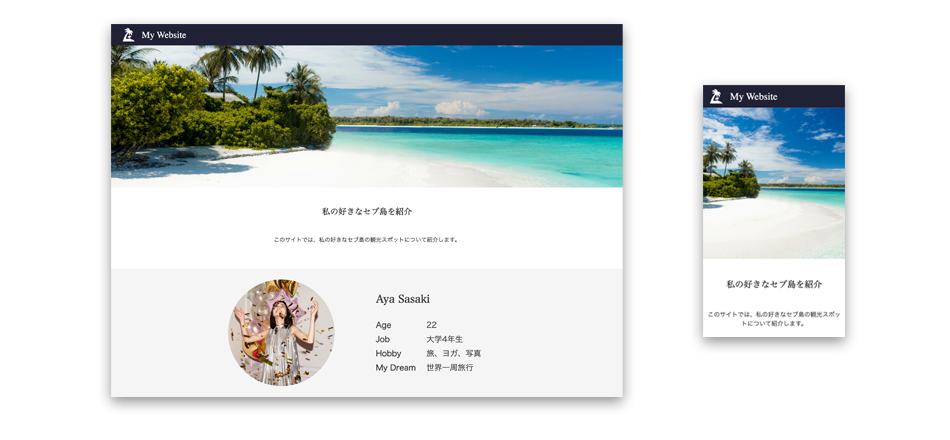

##  自己紹介サイトの模写プロジェクト

HTMLとCSSを使って、デザインカンプ（完成見本）と全く同じ見た目のウェブサイトを作成しましょう。

作成に必要な画像・デザインカンプは以下のリンク先から、ダウンロードして使用してください。

- [完成したアプリ](https://heuristic-shockley-4fb208.netlify.app/)

<!-- - [デザインカンプ](https://drive.google.com/open?id=1thv1b2gtBc9lUNksOla_QUBFza7Vj_72)
  - PC用のデザインとSP（スマートフォン）用のデザインがあります。 -->

## 答えの用意

1.My_Website.zipをクリックし、zipファイルをダウンロードしましょう。

2.上記zipファイルを解凍しましょう。

3.回答されたフォルダが完成された成果物になります。

## 2.作成準備
【答えの用意】で完成された成果物を用意できています。

フォルダ構成を答えと同じ状態で作成しましょう

imgフォルダの中身はimg.zipをダウンロードし、中身を自分で作成したimgフォルダ内にD&Dしてコピーしましょう。
