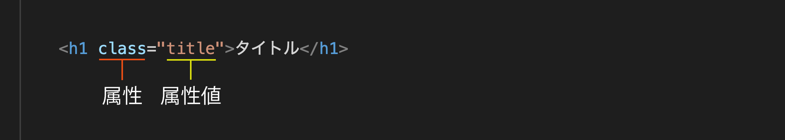
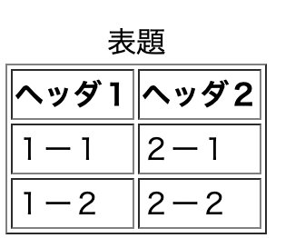
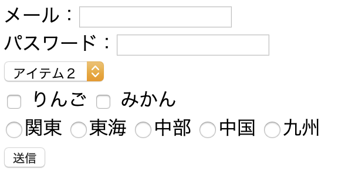

# HTMLについて

以下の項目について解説していきます。
1. 概要
2. HTMLの基本構成
3. 基本用語
4. 書き方
5. ブロック要素とインライン要素

## 1. 概要
HTMLとは、Webサイトの構造を定義する**マークアップ言語**の1つです。

**HyperText Markup Language**の略で、  
直訳すると「ハイパーテキストをマークアップする言語」となります。  

### マークアップ言語
マークアップ言語とは、Webサイトの構造を定義します。  
構造を定義するというのは、**Webサイトのどこが、どのような役割を表すか**  
を表現することです。

詳しくは後述しますが、
例えば、1つのWebページにはメインとなるコンテンツや、  
ページの見出しなどがあります。  
どこが見出しで、どこがメインのコンテンツかといったことをHTMLで定義します。


### HyperText(ハイパーテキスト)
では、**HyperText(ハイパーテキスト)** とは、何かというと、  
他のページへのリンクを埋め込むことができるテキストのことです。

例えば皆さんがGoogleで何か検索すると、検索結果の一覧が表示されると思います。 
検索結果の一覧から見たいページをクリックすると、画面が切り替わるかと思いますが、 
この時クリックしているのが他のページへのリンクです。  
また、このリンクのことを**ハイパーリンク**と呼びます。
<br>
<br>
<br>

## 2. HTMLの基本構成
HTMLで使用されるタグ要素を紹介したので、  
次はそのタグ要素を使用してどのようにWebサイトを作成するか説明します。

HTMLは複数のタグで構成されます。
大きく分けると次のような構造になります。


<!---->

上の構造をHTMLのコードで表すと以下のようになります。  
以下のコードはどんなWebサイトを作成する場合でも  
必ず書くことになります。

```html
<!DOCTYPE html>
<html lang="ja">
<head>
    <meta charset="UTF-8">
    <title>HTML_basic</title>
</head>
<body>
    ここに書いた内容が画面に表示される。
</body>
</html>
```

1つずつ説明します。

### !DOCTYPE html
まず`<!DOCTYPE html>` です。    
これはHTMLファイルの一番上に書いて、  
HTML5を使用することを宣言します。  
※HTMLには長い歴史があり現在の最新バージョンが5です。

### html
`<html></html>`タグはファイルのコード全体を囲みます。  
このタグの役割は、 囲まれた文章がHTMLであることを示しています。  
`lang`は属性になります。

### head
`<head></head>`タグにはファイルの**メタデータ**を記述します。  
メタデータとはそのファイル自体の情報、  
例えば、そのファイル(webページ)の説明や、タイトル(ブラウザのタブに表示される部分)です。  

### body
`<body></body>`タグには実際に画面に表示される画像やテキストを記述します。  

<!--  -->
## 3. 基本用語
ここではHTMLの基本的な書き方と各部の名称を順に紹介します。  

### 紹介する用語一覧
- コンテンツ
- タグ
- 要素
- 属性


### コンテンツ
コンテンツとは実際に画面に表示されるテキストや画像のことです。

### タグ
HTMLでWebサイトのどの部分がどういった役割をしているか表すということは
前述の通りですが、  
この役割を表すのが**タグ**になります。    

タグには大きく分けて以下の2種類があります。  
①**開始タグ**と**終了タグ**の2つのタグで成り立つもの  
②開始タグのみで、終了タグがなく**1つのタグ**で成り立つもの

以下の例でいうと、  
`<h1>`が開始タグ、`</h1>`が終了タグ、  
開始タグと終了タグで囲まれている部分が**コンテンツ**  
となります。
終了タグには`/`が入ります。

```html
<!-- ①のタグの例 -->
<h1>ここがコンテンツ</h1>
```

以下の例で使用してる``は画像を表示するタグで、  
終了タグがありません。

```html
<!-- ②のタグの例 -->

```

それぞれのタグごとに①の使い方と②の使い方どちらか決まっており、  
①と②どちらでも自由に選べるわけではありません。  
主に①のパターンが多いです。

#### 参考リンク
[目的別タグ一覧](http://www.htmq.com/html/indexm.shtml)


### 要素  
**要素**とは開始タグから、終了タグまでコンテンツも含んだ全体になります。
※**タグ**はコンテンツを囲っている部分のことで、コンテンツは含みません。

以下の例だと、  
`<div>コンテンツ</div>`全体で**要素**となります。
```html
<div>コンテンツ</div>
```

### 属性
属性とは、要素に対して、補足的な情報を追加するものです。  
開始タグに記述します。



属性には、どのタグにも使用できる**グローバル属性**と、  
**特定のタグのみでしか使えない属性**の2種類があります。  
また、属性に指定する値のことを**属性値**と呼びます。  
開始タグの中で、`属性=属性値`といった書き方をします。  
属性の詳細に関してはここでは取り扱いませんが、  
興味がある方は以下の参考リンクを確認してみてください。


```html
<!-- class属性に属性値としてtestを指定 -->
<p class="test">HTMLテスト</p>

<!-- id属性に属性値としてtestを指定 -->
<div id="test"></div>

<!-- href属性に属性値としてindex.htmlを指定 -->
<!-- hrefはリンクを指定するための属性 -->
<a href="index.html"></a>
```

#### 参考リンク
- [属性一覧](https://developer.mozilla.org/ja/docs/Web/HTML/Attributes)

<br>
<br>
<br>

## 4. 書き方

### 入れ子構造

```html
<body>
    <div>
        <span>My Page</span>
        <nav>
            <ul>
                <li></li>
                <li></li>
                <li></li>
            </ul>
        </nav>
    </div>
</body>
```
コードを確認いただくとわかりますが、  
`<body></body>`の中に`<span></span>`と`<nav></nav>`が入っており、  
`<nav></nav>`の中に、`<ul>`があり、さらにその中に`<li></li>`が入ってます。  
このようにHTMLは複数の
タグが**入れ子構造**になっています。

ある要素からみた時、その要素を囲っている要素を**親要素**、  
その要素の中にある要素を**子要素**、  
その要素と同じ階層にある要素を**兄弟要素**と言います。  

`<nav></nav>`を起点とした場合、`<div></div>`は親要素、  
`<ul></ul>`は子要素、  
`<span></span>`は兄弟要素  
となります。


### インデント
インデントとは**字下げ**のことです。  
HTMLが入れ子構造になることは前述の通りですが、  
インデントを使用することで、  
**要素の入れ子構造(親子関係)** がわかりやすくなります。  
また、**開始タグと終了タグ**の関係もわかりやすくなります。

##### インデントされていないコード
```html
<div>
<div>
<h2>勉強すること</h2>
<ul>
<li>プログラミング</li>
<li>英語</li>
</ul>
</div>
<div>
<h2>趣味</h2>
<ul>
<li>ギター</li>
<li>ドラム</li>
</ul>
</div>
</div>
```

##### インデントされているコード
```html
<div>
    <div>
        <h2>勉強すること</h2>
        <ul>
            <li>プログラミング</li>
            <li>英語</li>
        </ul>
    </div>
    <div>
        <h2>趣味</h2>
        <ul>
            <li>ギター</li>
            <li>ドラム</li>
        </ul>
    </div>
</div>
```

インデントするのは**子要素を書く時**です。  
上の例ですと、`<li>`が`<ul>`の子要素のため、  
インデントしています。  

インデントしなくてもシステム上間違いではないため、  
正しく動作しますが、インデントすることで、**読みやすく**なります。  
読みやすいので、**間違いも見つけやすく**なるため、  
インデントを意識して書くようにしましょう。


### 改行と空白
HTMLでは、改行も空白文字類として扱われます。  
HTMLコード内で改行をしても、Webブラウザでは改行はされません。  
改行を表現するには`<br>`タグを使います。  
また、語と語の間にスペースを入れたい場合は、  
適切な要素を使うかスタイルを指定して、スペースを確保します。   
HTMLコード内に複数のスペースを入れたとしても、  
ブラウザではそのとおりに表示されません。

### セマンティックHTML
HTMLの役割がWebサイトの構造を定義すること、  
定義するとは、 **どこが、どのような役割を表すか**を表現すること、  
それを表現するためにタグを使用する  
ということは前述しました。  

そして**セマンティックHTML**とはその要素の役割に合うタグを  
正しく使用しましょうという考え方です。  
<br>
<br>
<br>


## 5. ブロック要素とインライン要素
HTMLは複数のタグ(要素)を組み合わせて構成されることを説明しましたが、  
`body`の中で使用される要素には大きく分けて  
**ブロック要素**と**インライン要素**の2つがあります。  

### ブロック要素
ブロック要素には、`<div>`や、  
見出しを表す`<h1>` ~ `<h6>`や、段落を表す`<p>`などがあります。  
ブロック要素内には、別のブロック要素やインライン要素を入れることができます。  

**要素の横幅は画面いっぱいになり、前後に改行が入ります。**  
そのため、以下のようなHTMLがあった場合、文章は縦に3つ並びます。  

```html
<body>
    <div>
        <p>縦に並びます</p>
        <p>縦に並びます</p>
        <p>縦に並びます</p>
    </div>
</body>
```
<!--<br>-->
＜実行結果＞


### インライン要素
インライン要素は主にブロック要素の子要素として使用されます。  
`<span>`や、画像を表示するための``などがあります。
インライン要素の中にはインライン要素を入れることができますが、  
ブロック要素を入れることはできません。  

**要素の横幅は、文章の幅と等しくなり、前後に改行は入りません。**  
そのため、以下のようなHTMLがあった場合、文章は横に3つ並びます。  
```html
<body>
    <div>
        <span>横に並びます</span>
        <span>横に並びます</span>
        <span>横に並びます</span>
    </div>
</body>
```


＜実行結果＞


すでにいくつかタグを紹介してますが、  
画像を表示するための``など特殊なタグを除けば、  
`<div>`と`<span>`のみでWebサイトは作成できます。  
※`<div>`は特に意味を持たないブロック要素、  
※`<span>`は特に意味を持たないインライン要素です。  

HTMLのバージョンが現在5であることも前述しましたが、  
5になった際に、**セマンティックHTML** を実現するためのタグが複数追加されています。  

最初はそこまで深く考える必要はありませんが、  
そういう考え方をする必要があるということだけ、  
頭の片隅にとどめておいてください。

#### 参考リンク
- [HTML4とHTML5の違い](http://www.htmq.com/html5/002.shtml)

<br>
<br>
<br>

----

# 練習
ここまでで、HTMLのタグや構造について説明しました。  
以下の欄では、主要なタグを使用して、いくつかのサンプルを記述しています。  
読むだけではなく、実際に自分でも書いて、書くことに慣れましょう。  

<!-- コードは`question/html_css/html_basic/index.html`に記述してください。  
ブラウザでの表示を確認は、  
Google chromeにドラックアンドドロップするだけです。 -->

## 1. 見出し
見出しを表すタグには`<h1>`から`<h6>`まであります。

```html
<div>
    <h1>見出し1</h1>
    <h2>見出し2</h2>
    <h3>見出し3</h3>
    <h4>見出し4</h4>
    <h5>見出し5</h5>
    <h6>見出し6</h6>
</div>
```

#### 結果


---

## 2. 行と段落

### p(段落)
`<p>`で囲まれた文字列は、段落区切りを示します。  

```html
<p>ここは最初の段落です。</p>
```

### br(改行)
`<br>`で改行できます。

```html
<p>ここは最初の段落です。<br>ここで改行されます。</p>
```

#### 結果


---

## 3. リスト
### ul（順不同リスト）、ol（序列リスト）、li（リスト項目）
順番に依存しないリストは`<ul>`、  
順序に意味のあるリストは`<ol>`を使います。  
リストの項目は`<li>`で囲みます。  
リストは入れ子にできますが、  
`<ul>`と`<ol>`を混在させることは推奨されません。

```html
<ul>
    <li>項目A</li>
    <li>項目B</li>
</ul>

<ol>
    <li>項目1</li>
    <li>項目2</li>
</ol>
```

#### 結果


---

```html
<!-- こういう書き方はNG！ -->
<ul>
    <ol>
        <li>項目</li>
    </ol>
</ul>
```

## 4. テーブル
`<table>`を使うことで、表を作成できます。  
表を作成するためのタグには以下のようなものがあります。

- table
    - 表の枠になります。border属性で枠線を指定できます。
- caption
    - 表の性質に関する記述、いわゆる表題を記述します。
- thead
    - 表の見出しを表します。
- tbody
    - 表の内容を表します。
- tr
    - 行を表します。
- th, td
    - 表のセルを表します。thは見出し用のセルに使用します。

```html
  <div>
      <table border="1">
          <caption>表題</caption>
          <thead>
              <tr>
                  <th>ヘッダ１</th>
                  <th>ヘッダ２</th>
              </tr>
          </thead>
          <tbody>
              <tr>
                  <td>１ー１</td>
                  <td>２ー１</td>
              </tr>
              <tr>
                  <td>１ー２</td>
                  <td>２ー２</td>
              </tr>
          </tbody>
      </table>
  </div>
```

#### 結果


---

## 5. リンク
`<a>`でリンクを作成できます。  
リンクには
1. 他ページへのリンク
2. ページ内リンク
の2種類があります。  

### 1. 他ページへのリンク
```html
<div>
    <a href="https://nexseed.net">NexSeed</a>
</div>
```

### 2. ページ内リンク
`<a>`とid属性を使用して、  
同じページの別の要素へのリンクを作成することができます。  
`<a>`の`href`属性にリンク先の`id`の属性値を指定します。  
リンク先のタグに、`id`属性を指定します。  

```html
 <a href="#section-01">概要へ移動します</a>

 <!-- 移動したことがわかりやすいように改行をいれています。 -->
 <br><br><br><br><br><br><br><br><br><br><br><br>
 <br><br><br><br><br><br><br><br><br><br><br><br>
 <br><br><br><br><br><br><br><br><br><br><br><br>

 <h2 id="section-01">概要</h2>
```

##### 結果


---

## 6. 画像
``を使用することで、画像を表示することができます。  
`<src>`に画像のURLを書きます。   
`alt`属性には`<src>`の画像が何かを書きます。  
画像に何らかの問題があり、表示できない場合に、代わりに文字を表示します。

```html
 <div>
     
 </div>
```

#### 結果


---

## 7. フォーム
`form`を使用することで、  
ログインフォームやお問いあわせフォームの入力部分を作成できます。  
フォームには、テキストボックスやチェックボックス、  
セレクトボックスやラジオボタンなど様々なものがあります。  
フォームは非常に多くの属性を使用しますが、現時点では特に覚える必要はありません。  

```html
 <div>
     <form action="" method="post">
         <div>
             <!-- テキストボックス -->
             メール：<input type="text" name="email"><br>
             <!-- パスワード用のテキストボックス -->
             パスワード：<input type="password" name="password"><br>
         </div>
 
         <div>
             <!-- セレクトボックス -->
             <select name="list">
                 <option value="item1">アイテム１</option>
                 <option value="item2">アイテム２</option>
                 <option value="item3">アイテム３</option>
             </select>
         </div>
     
         <div>
             <!-- チェックボックス -->
             <input type="checkbox" name="fruit" value="apple"> りんご
             <input type="checkbox" name="fruit" value="orange"> みかん
         </div>
     
         <div>
             <!-- ラジオボックス -->
             <input type="radio" name="region" value="kanto">関東
             <input type="radio" name="region" value="tokai">東海
             <input type="radio" name="region" value="tyubu">中部
             <input type="radio" name="region" value="tyugoku">中国
             <input type="radio" name="region" value="kyusyu">九州
         </div>
         <!-- フォームデータ送信ボタン -->
         <input type="submit" value="送信">
     </form>
  </div>
```

#### 結果


---

## まとめ
非常に多くのことを書いていますが、  
現時点で細かいところまで100%理解する必要はありません。  

以下の4つに関して説明してますが、  
まずは、概要だけ抑えておきましょう。
1. HTMLとは何か
2. 書き方と各部の名称
3. HTMLの基本構成
4. ブロック要素とインライン要素について