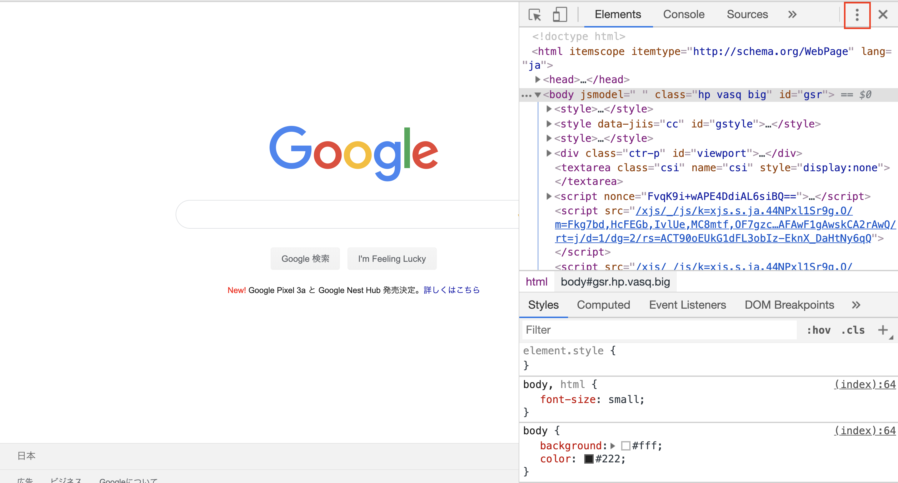
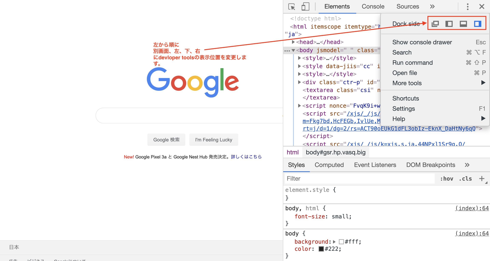
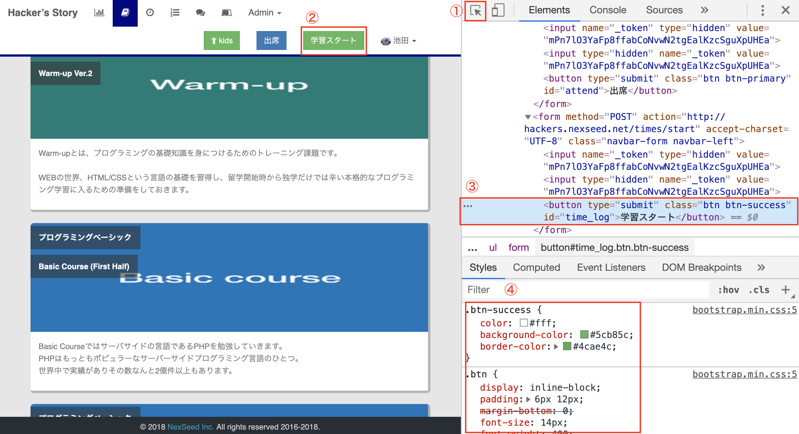
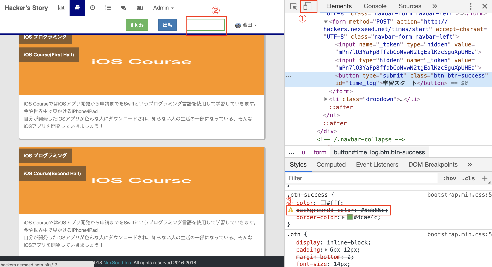

# chrome developer tools(デベロッパーツール)

## 概要
developer toolsとは、Google chromeに組み込まれた機能の1つで、  
Webサイトが表示される速度や、エラーの有無など様々なことを調べることができます。  

このカリキュラムでは、数ある機能の中から、  
HTMLやCSSのコーディングをする際に便利な機能を紹介します。

表示してるWebサイトでどのようなHTMLとCSSが書かれているか、  
また、HTMLとCSSを変更するとどうなるのか調べることができます。  

そのため、  
**参考にしたいWebサイトがどのように作成されているか確認**したり、    
**Webサイトを作成するときに自分が思った通りに変更されない原因を調べる**  
といったことに使用できます。

## 起動方法
まずは起動方法を紹介します。  
Google chromeを起動して任意のページを開いてください。  
起動方法は2つあります。
1. ページ内を右クリックして、[検証] を選択します。
2. ショートカットキーを使用します。
   -  Windows: Ctrl+Shift+I
   -  Mac:     Cmd+Opt+I

以下の画像がdeveloper toolsを起動した際の画面です。  
Googleの検索ボックスの右側に表示されているのが**developer tools**です。  
以下の画像ではdeveloper toolsは画面の右側に表示していますが、  
表示する位置はdeveloper toolsの右上にある「・」が縦に3つ並んだアイコンをクリックすることで変更できます。  
指定できるのは、画面の右、左、下または、別画面の4つです。   
このカリキュラムでは右側に表示した状態で進めますが、ご自身が使いやすい位置で表示してください。

また、developer tools内のメニューの位置は、  
developer toolsを表示してる範囲によってかわる場合があるため、  
以下の画像とレイアウトが異なる可能性がありますが、特に問題ありません。    

## メニューの説明
developer toolsの起動はできたので、  
次は主要なメニューの説明を行います。  

今回紹介するのは以下の3つのメニューです。  
- Elements
- Styles
- Console
- Network

選択されてるメニューの下には青いバーが表示されます。

### Elements
ElementsにはそのページのHTMLが全て表示されます。  

### Styles
StylesにはCSSが表示されます。  
表示されるCSSは、Elementsで、選択されている要素に設定されているCSSです。  

以下の例ではElementsの①の要素が選択されています。  
②が①の要素に設定されているCSSです。  
また、Elementsで選択された要素が画面のどの部分かわかるように、  
画面の方も色がかわります。  
③が①のHTMLを画面で表示した時の結果です。  
③の要素には青い部分と、緑、黄色、オレンジの部分がありますが、  
`青 = コンテンツ`、 `緑 = padding`、 `黄色 = border`、  `オレンジ = margin`を表しています。  

### Console
Consoleからは多くの情報を得ることができますが、    
JavaScriptというプログラミング言語の実行結果の確認で  
使用することが多いです。  

### Network
Networkではそのページが表示されるまでにかかった時間や、  
HTTPリクエストとメソッド、  
HTTPレスポンスのステータスコードなどを確認することができます。  
※Networkタブの内容を確認する場合、developer toolsを起動した状態で画面を表示する必要があります。

①ではリクエスト、レスポンスの詳細が確認できます。  
表示されている各メニューは、①の枠内を右クリックすることで、変更できます。 

主要な項目をいくつか紹介します。  
- Name
  - レスポンスで返ってきたデータ(HTML, CSS, 画像etc)の名前です。
- Method
  - HTTPリクエストのメソッド名です。
- Status
  - HTTPレスポンスのステータスコードです。

1つのWebページしか表示していないのに、  
statusコードなどが複数行になっており不思議に思われた方もいるかと思います。  

実は、1つのWebページを表示する場合も1回のリクエストではなく、  
HTMLを取得するために1回、CSSを取得するために1回、  
画像Aを取得するために1回といったように複数回リクエストが送られています。  
リクエストが複数回送られるため、レスポンスも複数回送られます。

②は**リクエストしてから最初のレスポンスが返ってくるまでの時間**です。

③は**レスポンスで返ってきたデータを全て画面に表示し終わるまでの時間**です。

## 使い方
主要なメニューの紹介をしたので、次にそれらの使い方を説明します。  
developer toolsを使用するのは、HTML/CSS関連ですと、前述の2つです。
1. 参考にしたいWebサイトがどのように作成されているか確認
2. Webサイトを作成するときに自分が思った通りに変更されない原因を調べる

### 参考にしたいWebサイトがどのように作成されているか確認
Webサイトを作成するときに、「あのサイトのボタンと同じようなものを作りたい!」  
というように、他のサイトを参考にしたいことがあります。

そういった場合もdeveloper toolsで対応できます。

Elementsの中の要素を選択することで、    
その要素が画面のどこに対応してるかわかるということは前述しましたが、  
画面の要素を選択することで、その要素のHTMLとCSSも確認することができます。  

以下の①をクリックした後に、画面上のHTMLとCSSを確認したい要素をクリックすることで、
対象の要素に設定されているHTMLとCSSを確認できます。

例えば以下の画像で②と同じボタンを作成したいと思ったとします。
その場合、
1. ①をクリック
2. ②をクリック
とするだけで、  
Elementsが③のように青くなり、  
Stylesに使用されているCSS(④)が表示されます。   

### Webサイトを作成するときに自分が思った通りに変更されない原因を調べる
次に自分がWebサイトを作成してる時にdeveloper toolsを使うケースを紹介します。  

基本的に、実施することは、他のサイトを参考にする場合と一緒です。

どんなに経験豊富なエンジニアでもミスをすることはあります。
例えばCSSを使用して、「ボタンの背景を変えたつもりが、  
ブラウザで確認したら変わっていない。」  

こういった場合もdeveloper toolで対応します。

例えば以下の画像で、②のボタンの背景を変えたつもりが変わっていなかったとします。  
その場合他のサイトを参考にする場合と一緒で、
1. ①をクリック
2. ②をクリック
とすると、   
Stylesに使用されているCSSが表示(③)されます。

今回のケースでは③の部分に、  
**黄色の背景の!があり、取り消し線が入ってるプロパティ**があります。  
これは、**そんなプロパティは存在しない**ということを意味しています。  
本来、`background-color`とするべきところが`backgroundd-color`になっているため、  
そこを修正することで問題を解決できます。  

## まとめ
Developer toolsは非常に便利で多機能な反面、  
機能が多いため、最初は使いにくく感じる部分もあるかと思います。  
他のカリキュラムも同様ですが、  
今の時点で全てを理解する必要はありません。  

現段階では、  
- Developer toolsというツールの概要
- Developer toolsでできること
を大まかに理解していただくだけで問題ありません。

もしもう少し深く知りたい場合は、  
以下の参考リンクをご確認ください。

## 参考リンク
[Chrome DevTools](https://developers.google.com/web/tools/chrome-devtools/?hl=ja)
