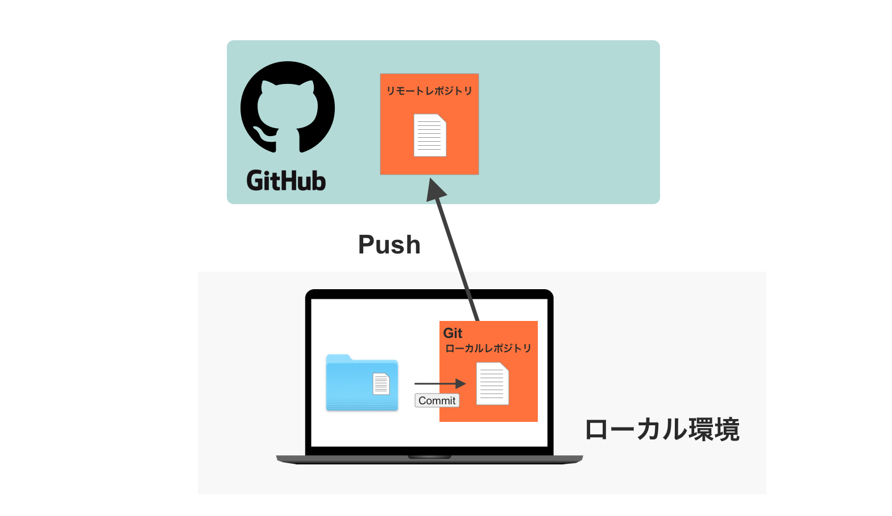
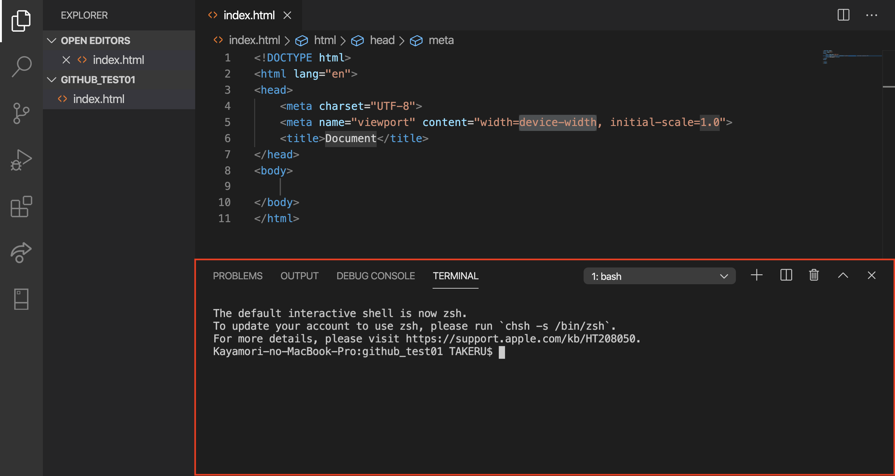
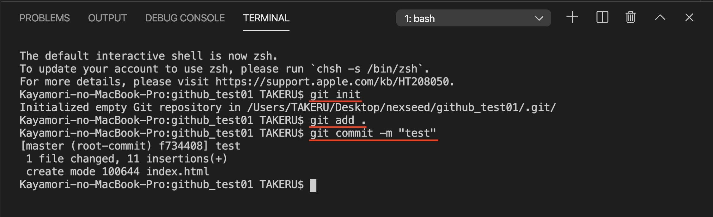
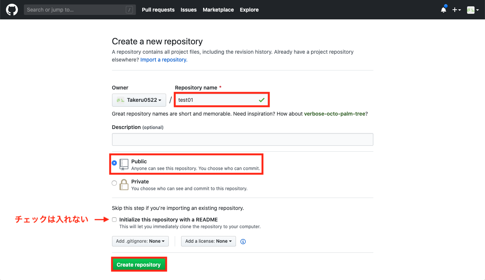
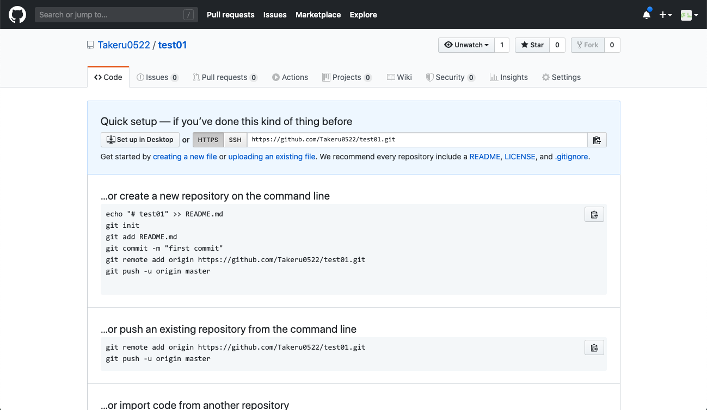
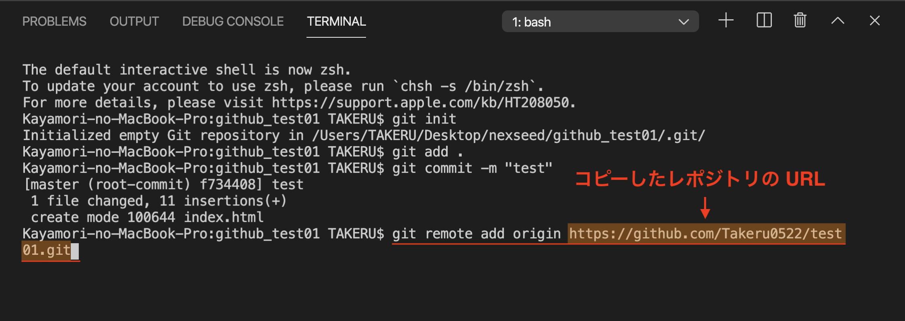
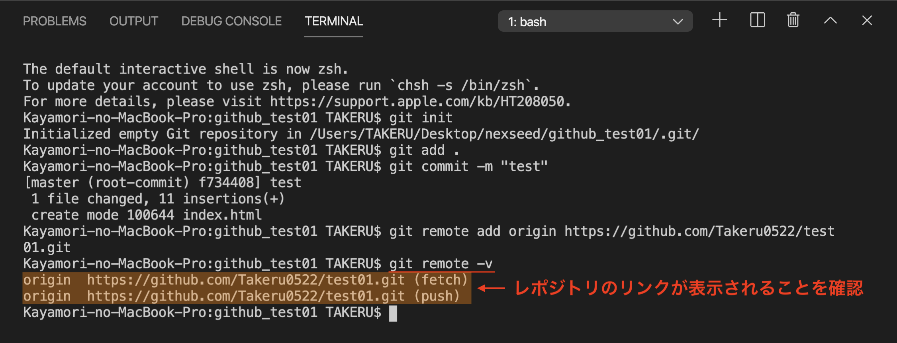

# GitHubにファイルをアップロードする手順

GitHubは、ソフトウェア開発プロジェクトのためのソースコード管理サービスです。
コードをオンライン上にアップロードすることで、保存したり、他の人と共同で作業したりすることができます。

今から解説する内容を図で表しました。

今はなんとなくのイメージだけ掴めばOKです。

ここでは、概念よりも手順に焦点を当てて解説するので、概念があまり理解できていない方はこちらの解説を先にお読みください。

- [GitとGitHubの概念の解説](https://github.com/NexSeed00/git_basic)

以下の４つのステップで解説していきます。

1. GitHubの登録
2. ローカルレポジトリの作成
3. リモートレポジトリの作成
4. ローカルレポジトリとリモートレポジトリを紐付ける

 

## 1. GitHubの登録

まずは以下のリンクからGitHubの登録を行いましょう。
- [GitHub](https://github.com/)

パスワードを忘れないよう必ずメモしておいてください。

 

## 2. **ローカル**レポジトリの作成

GitHubにアップロードしたいフォルダをVS Codeで開きます。
画面上のバーにある「Terminal → New Terminal」をクリックしてください。

 

すると画面下部にターミナルが開きます。

次の３つのコードを入力します。
1. `git init`
2. `git add .`
3. `git commit -m "任意のコメント"`

 

#### 1.  `git init`

initとはinitialize（初期化する）の略で、新しいGitレポジトリを作成するコマンドです。

#### 2.  `git add .`

コミットするファイルをします。
`.`と書くことでレポジトリ内の全てのファイル指定できます。 
`git add index.html`のように特定のファイルだけを指定することもできます。

#### 3. `git commit -m "任意のコメント"`
addで指定したファイルをコミットします。 
これによって初めてファイルがGitレポジトリに保存されます。 
コメントには、変更した内容など、どんな作業が行われたのかを、他の人が見てもわかるように書きましょう。

 

## 3. **リモート**レポジトリの作成

GitHubにログインすると、以下のようなページになります。 
右上の四角いアイコンをクリックするとメニューが開かれるので、「Your profile」をクリックしましょう。

 

このページは今後よく使うことになるので、ブックマークに保存しておきましょう。 
右上の「＋」のアイコンをクリックするとメニューが開くので、「New repository」をクリックします。

 

レポジトリの名前を入力し、Publicにチェックが入っていることを確認して、「Create repository」をクリックします。

レポジトリ名については以下のルールを守ってください。

1. 日本語ではなく、英語・アルファベットで入力
2. 何のレポジトリなのかわかる名前にする。
3. スペースを開けない。文字を繋げる場合は「_」または「-」で繋げる。（例. js_todo_listなど）

※３つ目の項目の「Initialize this repository with a README」には、チェックを入れないようにしてください。

 

Create repositoryを開くと、作成したレポジトリのページが開きます。これで、GitHub上（リモート）に空のレポジトリを作成することができました。

 

## 4. ローカルレポジトリとリモートレポジトリを紐付ける

次にローカルレポジトリとGitHub上（リモート）のレポジトリを紐付けます。
GitHubに戻り、レポジトリのURLをコピーします。

 

次に再びVS Codeに戻り以下のコマンドを入力します。

`git remote add origin コピーしたレポジトリのURL`

これが、実際にローカルレポジトリとリモートレポジトリを紐付けるコマンドです。

 

`git remote -v`でリモートレポジトリのURLを確認できます。

 

最後に、ローカルレポジトリをリモートにアップロードします。 
Gitではこのことを「プッシュ」と言います。

`git push origin master`のコマンドを入力します。

 

GitHubに戻り、ページをリロードしましょう。
以下の画像のようにプッシュしたファイルが表示されたら完了です。

ここまで行なった内容と冒頭にもあった画像を照らし合わせて頭の中でもう一度整理しましょう。

1. まずローカルで、Gitのローカルレポジトリを作成しました。
2. 次に`add`でファイルを指定し、
3. 指定したファイルを`commit`しました。`commit`によって、ファイルがGitのシステム上で保存されます。
4. GitHubに新しいレポジトリを作成（リモートレポジトリ）
5. ローカルとリモートのレポジトリを紐付け（`git remote add origin リモートレポジトリのURL`）
6. プッシュする（ローカルレポジトリ内のファイルをリモートレポジトリにアップロード）

最初は完全に理解できていなくても大丈夫です。使いながら徐々に慣れていきましょう。

GitHubの解説は以上になります。
お疲れ様でした！

