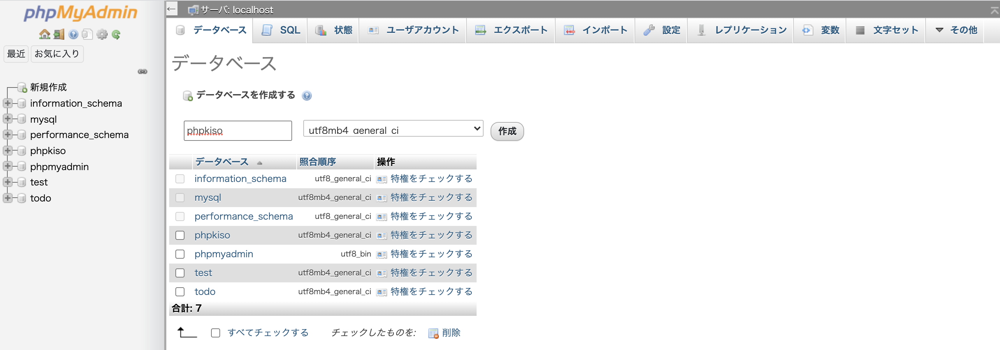
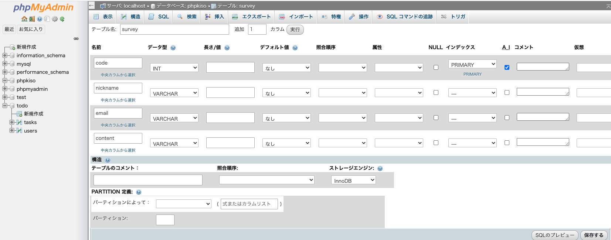

## データベースってどんなもの？
システムでは、多くのデータを取り扱います。（会員情報や商品情報etc）
そのデータを利用するために、データを整理・統合してまとめ、検索・活用しやすくした仕組みを「データベース」といいます。

## データベースの種類
データベースには大きくわけて「階層型」「ネットワーク型」「リレーショナル型」があり、その中で現在最も一般的に使用されているのは「リレーショナルデータベース（Relational Database : RDB）」です。
そして、リレーショナルデータベースを管理しているデータベース管理システム（Database Management System : DBMS）のことを「リレーショナルデータベース（RDBMS）」といいます。  
世界中ではたくさんのRDBMSが利用されており、「Oracle」「MySQL」「SQL Server」「Postgre SQL」などがあります。今回のエンジニア留学では、オープンソース（無料で公開されている）で多くのサービスに利用されているMySQLを使用していきます。

リレーショナルデータベースには、主に2つの特徴があります。

* データは2次元の表形式で表現される
* リレーション（複数の表を結合）が可能

リレーショナルデータベースではすべてのデータを表形式で表現します。
表は列と行で構成され、列は必ず1つの意味を持ちます。


また、1件のデータを「レコード（行）」、項目を「カラム（列）」、そしてレコードの集まりを「テーブル（表）」と呼びます。

## データベースの操作
データベースは、Excelのようにマウスでクリックして直接データを書き換えるということはできません。  
「SQL」と呼ばれる言語を使い、データの作成（ **C**reate）・取得（**R**ead）・更新（**U**pdate）・削除（**D**elete）を行います。  
この4つの処理を合わせて「**CRUD**（クラッド）」と呼びます。

PHPでデータベースを使用する場合は、「データベースに接続」「SQL文で命令を実行」「データベースを切断」という流れで使用します。

データベースは、CUI（コマンドライン）もしくはGUI（PHPMyAdmin）で操作することができます。今回のエンジニア留学では、GUIを使ってデータベースを操作していきます。

## データベース／テーブルの作成

実際に開発現場でデータベースを取り扱う場合、最初にデータベースの設計をしてからデータベースを作成します。  
データベース設計では、何のデータを・どのテーブルに・どのような型で保存するかを決めます。


今回使用するテーブルを作成してみましょう。  
データベース名は「phpkiso」、テーブル名は「survey」とします。

|論理名|物理名|型|NULL|キー|その他|
|:--|:--|:--|:--|:--|:--|
|問い合わせコード|code|INT(10)|NO|PRI|auto_incriment|
|ニックネーム|nickname|VARCHAR(20)|NO|||
|メールアドレス|email|VARCHAR(50)|NO|||
|問い合わせ内容|content|VARCHAR(50)|NO|||

* code
    * データの通し番号（CRUD処理の際、データの管理をしやすくするため）
* VARCHAR
    * PHPのString型（文字列型）と同じ
    * VARCHARに設定した場合は、文字の長さを指定する必要がある
* Primary Key
    * 同じカラム内で、値を重複させず一意にする設定
* A_I（Auto Increment）
    * 自動で数字をインクリメント（カウントアップ）する設定（**自動採番**）
* NULL
    * 空の値の入力を許可するかどうか
    
 ### phpmyadminを開きましょう。
[こちら](http://localhost/phpmyadmin/)をクリックしてください

 ### databaseを作成しましょう
 下記の図のように左側にある【新規作成】をクリックし、【database】名をphpkisoと入力し、作成ボタンをクリックします。
 

 ### テーブルを作成しよう
 下記の図の通り、手順を進めていきましょう。<br>
 左側に作成したデータベースが表示されるので、phpkisoをクリックします。<br>
 すると下記の画像のような表示がでます。<br>
 ここに**survey**というテーブル名を入力し、作成をおします。
 

 ### テーブルのカラムを設定しましょう
 下記と同じ設定にして、保存しましょう
 
 
 ### 準備は完了です
 下記のSQL例文を該当のデータベース、テーブルを選択した状態で,SQLタブをクリックし、SQL文を実行していきましょう

## SQL
データベースに入っているデータを操作するには、SQL文を使用します。

### INSERT文
テーブルにレコードを追加する場合は、**INSERT**という命令を行います。

テーブルにレコードを追加してみましょう。

```sql
INSERT INTO `survey` (`nickname`, `email`, `content`) VALUES ("seedkun", "seed@mail.com", "ここに問い合わせ内容");
```

INSERT文は、以下の書式で記述します。

```
INSERT INTO テーブル名(カラム名1, カラム名2…) VALUES("値1", "値2", …);
```

### SELECT文
それでは、追加したレコードの中身を見てみましょう。テーブルからレコードを取得する場合は、**SELECT**という命令を行います。

```sql
SELECT * FROM `survey`;
```

SELECT文は、以下の書式で記述します。

```
SELECT 取得したいカラム名1, 取得したいカラム名2, ... FROM テーブル名 WHERE 絞り込み条件;
```

カラム名に、取得したいカラムを指定します。全てのカラムを指定する場合は、アスタリスク「*」を使います。  
また、絞り込み条件を指定することで、ある条件に合致するレコードのみを取得できます。
絞り込み条件が不要な場合は、「WHERE 絞り込み条件」の部分を記述しません。「WHERE 1」の場合は、「無条件」と同じ意味になります。

#### 文字列に対する絞り込み
* **カラム名=検索文字**
    * カラムの値が検索文字に一致するレコードを表示（完全一致）

```sql
WHERE `email`="seed@mail.com"
```

* **カラム名 LIKE 検索文字**
    * カラムの値に検索文字を含むレコードを表示（部分一致・あいまい検索）

```sql
-- emailに「seed」を含む
WHERE email LIKE "%seed%"

```

```sql
-- emailが「seed」で始まる
WHERE email LIKE "seed%"
```

```sql
-- emailが「seed」で終わる
WHERE email LIKE "%seed"
```

#### 数値に対する絞り込み
* **カラム名 > 数値**
    * カラムの値が数値より大きいレコードを表示

```sql
WHERE code > 3
```

* **カラム名 < 数値**
    * カラムの値が数値より小さいレコードを表示

```sql
WHERE code < 3
```

* **カラム名 >= 数値**
    * カラムの値が数値以上のレコードを表示

```sql
WHERE code >= 3
```

* **カラム名 <= 数値**
    * カラムの値が数値以下のレコードを表示

```sql
WHERE code <= 3
```

### UPDATE文
次は、レコードの更新をしてみましょう。レコードを更新する場合は、**UPDATE**という命令を行います。

```sql
UPDATE `survey` SET `email`="nexseed@mail.com", `content`="問い合わせ内容を更新" WHERE `code`=1;
```

上記UPDATE文を実行すると、codeが1のレコードで、emailとcontentの内容が更新されます。

UPDATE文は、以下の書式で記述します。

```
UPDATE テーブル名 SET カラム名1="値1", カラム名2="値2", ... WHERE 条件;
```
条件の書き方はSELECT文と同じで、更新対象のレコードを絞り込む目的で使用します。
条件を記述しないと、全てのレコードが更新されてしまいますので注意しましょう。

### DELETE文
次は、レコードを削除してみましょう。レコードを削除する場合は、**DELETE**という命令を行います。

```sql
DELETE FROM `survey` where `code`=1;
```

上記DELETE文を実行すると、codeが1のレコードが削除されます。

DELETE文は、以下の書式で記述します。

```
DELETE FROM テーブル名 WHERE 条件;
```

条件の書き方はSELECT文と同様で、DELETE文の場合は削除する対称のレコードを絞り込むために記述します。
DELETE文でWHERE条件を忘れてしまうと、全てのコードが消えてしまうため注意して使いましょう。


## SQLまとめ
### データを登録（INSERT）
* 構文
    * **INSERT INTO テーブル名 (カラム名1, カラム名2, ...) VALUES(値1, 値2, ...);**

### データを取得（SELECT）
* 構文
    * **SELECT カラム名1, カラム名2, ... FROM テーブル名 WHERE 条件;**
* 例文

データを全取得する場合

```
SELECT * FROM `users`
```

指定したカラムのみ取得する場合

```
SELECT `id`, `name` FROM `users`;
```

条件つきでデータを取得する場合

``` 
SELECT * FROM `users` WHERE id = 2; 
```

複数の条件で絞り込んでデータを取得

``` 
SELECT * FROM `users` WHERE id > 3 and id < 6;
```

並べ替えてデータを取得

``` 
SELECT * FROM `users` ORDER BY id ASC; (昇順) 
```

``` 
SELECT * FROM `users` ORDER BY id DESC; (降順) 
```

### データを更新（UPDATE）
* 構文
    * **UPDATE テーブル名 SET カラム名="更新する値" WHERE 条件;**

### データを削除
* 構文
    * **DELETE FROM テーブル名 WHERE 条件;**
