# デプロイとは？
英単語としてのデプロイ（英：deploy）は、「展開する、配置する」といった意味があります。

システム開発におけるデプロイとは、開発したアプリケーション（機能やサービス）をサーバー上に展開・配置して利用できるようにすることです。

Webアプリケーションであれば実行ファイルをWebサーバーやアプリケーションサーバーにアップロードして、その実行ファイルを実行することでサーバー上でアプリケーションを動くようになり、ユーザーが利用できる状態になります。この一連の作業がデプロイです。

つまり、

- 実行ファイルを動かしたい環境に置く
- 実行ファイルを実行する
これらを行うことがデプロイです。

## 全世界に公開しよう

今まで作成した成果物、Web開発プロダクトは、ローカル環境でしか動作しません。(自分のPC)

これをデプロイを行うことにより本番環境上で動作可能にし、何処からでも自分の成果物を見れるようにしていきます。

自分の成果物をデプロイし、ポートフォリオとして就職活動に持っていったり、友達に自慢しましょう。

## デプロイするために準備するもの
- [Herokuのアカウント作成](https://jp.heroku.com/)
- [GitHubのアカウント作成](https://github.com/)
- [Sourcetreeのインストール](https://www.sourcetreeapp.com/)
- [homebrewのインストール](https://brew.sh/index_ja)

## Herokuとは
PHPやPythonなどのプログラミング言語を用いて開発したWebアプリ、WebサービスなどをWeb上で簡単に公開できるというサービスです。

今回はこのHerokuというサービスを使って成果物をデプロイしていきます。

### 最初に
【デプロイするために準備するもの】を用意しましょう。<br>
ここまでカリキュラムを進めてきた皆さんは、Herokuアカウントとhomebrewをインストールすれば準備完了です。

### Step1 Heroku CLIのインストール
Heroku CLIはherokuをコマンドで操作するために必要なツールです。<br>
ターミナルを開いて下記を実行しましょう

```
$brew tap heroku/brew && brew install heroku
```

インストール完了後に下記を実行します

```
＄heroku login
```

すると下記のように表示がでるので、何でも良いので　キーボードを叩きます

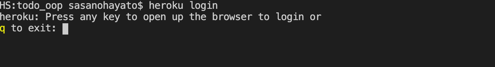


ブラウザが起動し、下記のように表示されればLog inを押しましょう。

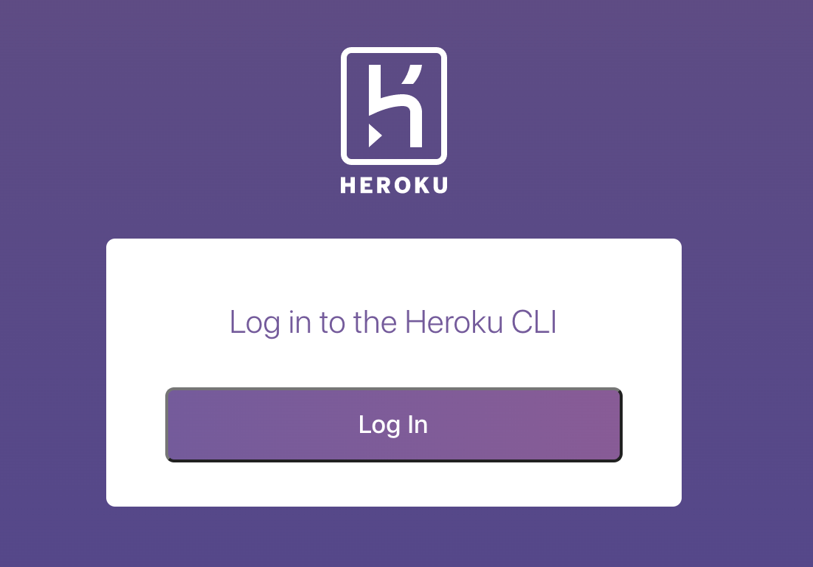

### Step2 HerokuでCreate new appをしよう

まずは下記のURLへアクセスしましょう
- [Heroku](https://dashboard.heroku.com/apps)

【new】ボタンから【create new app】を選択しましょう

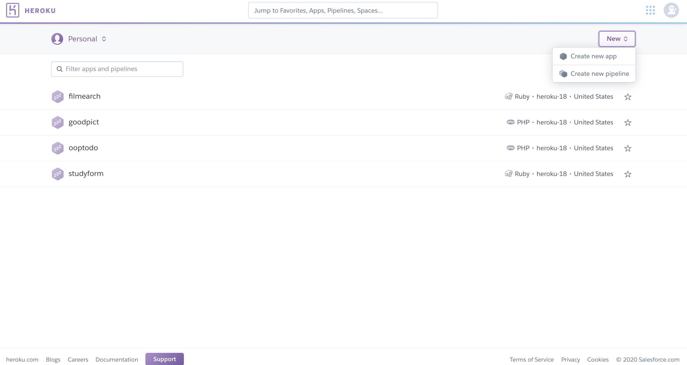

すると下記のページになりますので、<br>
- App nameに【作品の名前】
- Choose a regionで【Japan】<br>
を選択しましょう

終われば、【Create app】をクリックします

### Step3 デプロイしよう

Githubと連携し、herokuにデプロイしていきます。

そのため成果物をSourcetreeを使用してGithubにpushして最新の状態にしておきましょう。

Githubを最新の状態にしたら下記に進みましょう

herokuサービス内で【Deploy】というタブをクリックすると下記の図のように表示が出ます
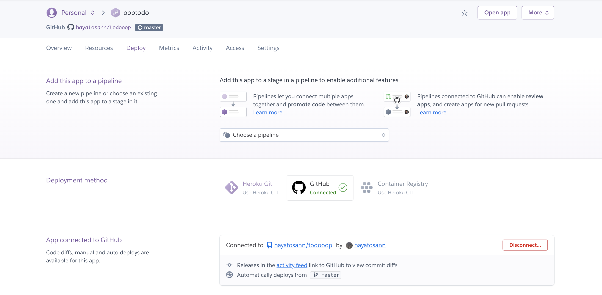

GitHubをクリックし、認証しましょう。<br>
この作業を行うことでHerokuとGithubの連携が可能になります

【Connect to Github】から自分がデプロイしたい成果物を選択します。

下記の図のように【Automatic deploys】や
【Manual deploy】の項目が確認できます。

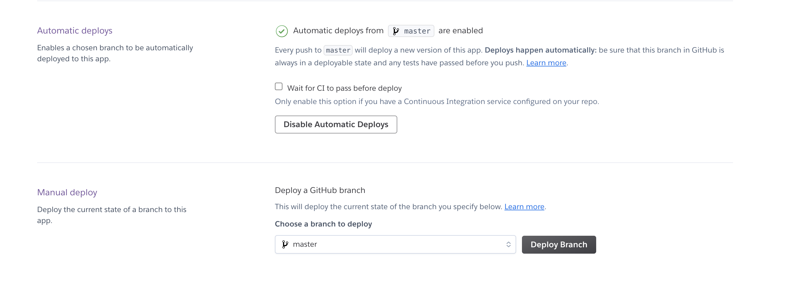

【Manual deploy】で【Deploy Branch】がmasterであることを確認し、【Deploy Branch】をクリックしましょう

以上でデプロイは終了です。

下記にある【Open app】からデプロイした成果物を確認してみましょう
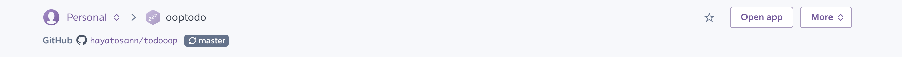


どうでしょうか。<br>
エラーがでていたり、成果物がローカルでは動くのに本番では正常に動いていないですね

例えば、皆さんがこれまでのカリキュラムで作成したアプリで説明すると

to doアプリは**MySQL**を使用していました。

これは自分のPC内にあるデータベースを使用していたことになります。

本番環境でもデータベースを用意してあげる必要があるのです。

もうひと頑張り!!<br>
次のステップに進みましょう

### Heroku Add-onsからClearDB MySQLをインストール

HerokuではデフォルトでPostgresというデータベースを使用するようになっています。

しかし、私達が今までのカリキュラムで使用してきたデータベースはMySQLです。

本番環境でもMySQLを使用したいところです。


下記の図のように【resources】タブをクリックします。<br>
そして【Find more add-ons】をクリックしましょう


下記のように別ページに飛ぶので、そこから【ClearDB MySQL】を探します


【ClearDB MySQL】をクリックします。

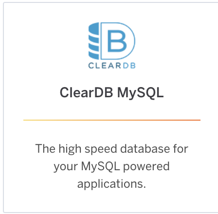

クリックすると下記の画面が表示されます

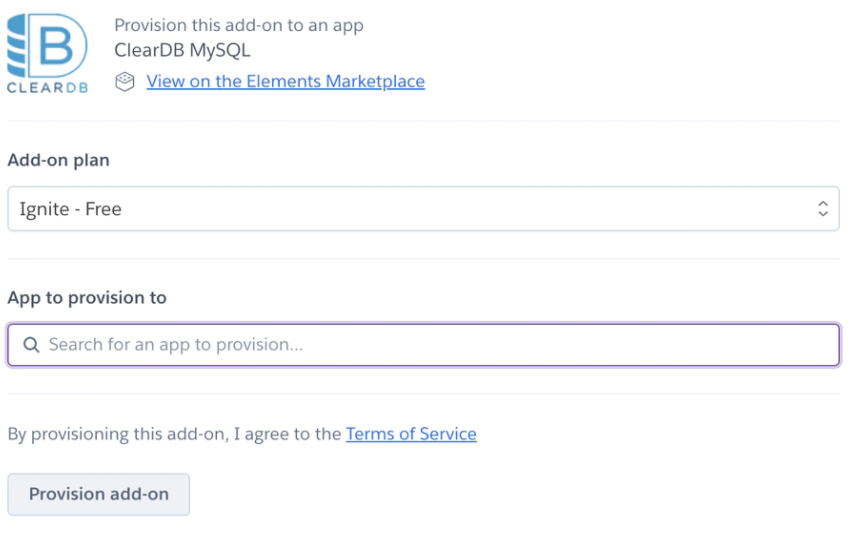

- 【Add-on plan】は何も操作がいりません
- 【App to provision to】にHerokuで作成したアプリの名前を入力します<br>
**【Create new app】で命名したものです**

最後に【Provision add-on】をクリックしましょう

インストールが終了すれば【Resources】のタブをクリックし、**ClearDB MySQL**がインストールできていることを確認しましょう<br>
下記のように表示できていれば成功です。

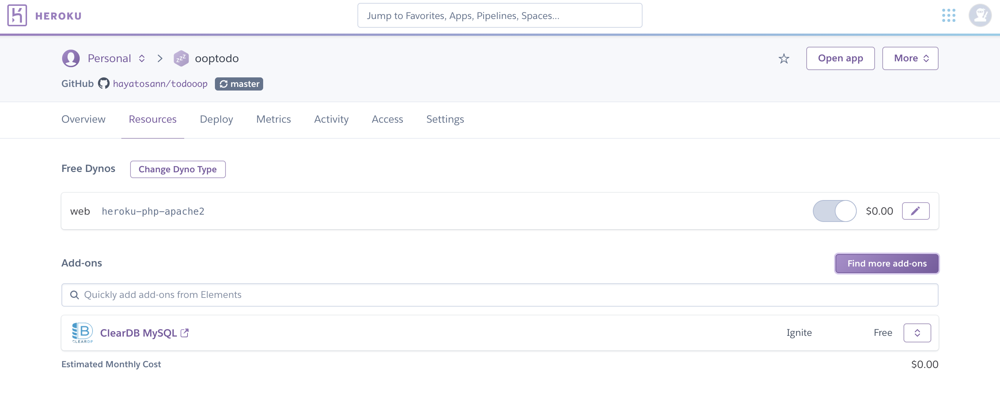

**注意点:クレジットカードを登録しておく必要があります**

特別なことがない限り、お金を請求されることはありません。

データベースの容量を増やしたりすると金額が発生します。

クレジットカードの登録方法は下記の図の通り、
画面右上のアイコンをクリックすると
【Account settings】と表示がでるので、クリックします。


その後、【Billing】というタブが表示されるのでクリックし、必要な情報を入力しましょう。

### GUIツールのインストール
**Sequel pro**のインストール（mac）
- [Sequel pro](https://www.sequelpro.com/)

**Table Plus(windows)
- [Table Plus](https://tableplus.com/)

上記をクリックし、インストールしましょう

**なぜ使うのか?**

今までのカリキュラムではローカル環境、つまり自分のPC内でデータベースを操作する際に、**phpmyadmin**を使用してきました。<br>
今回は本番環境でのデータベースを用意する必要があります。本番環境のデータベースを操作する際に、可視化ツールであるGUIを使いたいと考えました。
phpmyadminではなく、今回はSequel proというGUIツールを使用します。
こちらも非常に便利なツールですので、使いこなせるようになっていきましょう.<br>
学習の幅を広げるためにも、Sequel proを使用していきましょう。

インストールが終われば起動しましょう

下記の図のように表示がされます

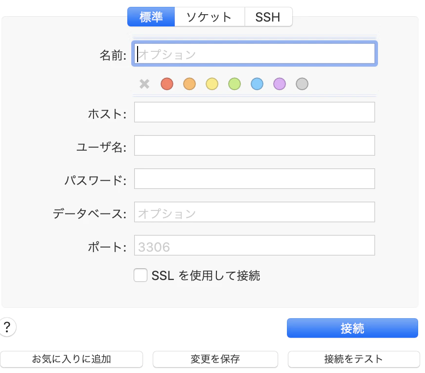

- ホスト名(hostname)
- ユーザー名(username)
- パスワード(password)
- データベース(dbname)

以上の項目にHerokuサービスにあるClearDB MySQLで取得されるデータを入力します

Herokuサービスに戻り、下記の図のように【Setting】タブをクリックします。

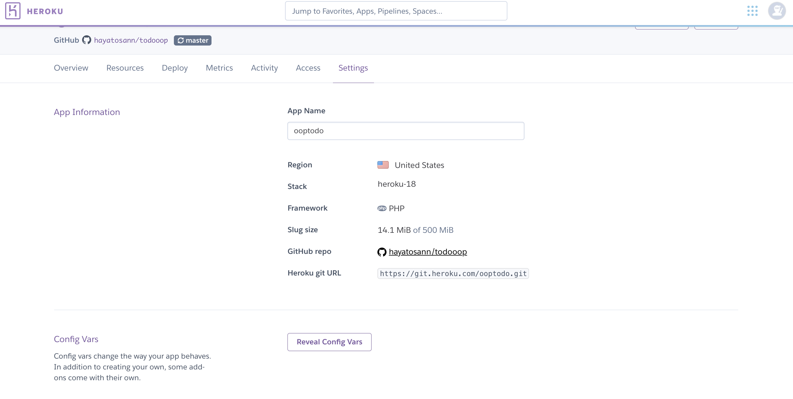

【Reveal config Vars】をクリックしましょう

```
CLEARDB_DATABASE_URL

mysql://(--username--):(--password--)@(--hostname--)/(--dbname--)?reconnect=true
```

ご自分のものと上記を照らしあわせてください

Sequel proに戻り、下記を入力します

- ホスト名(hostname)
- ユーザー名(username)
- パスワード(password)
- データベース(dbname)

入力後、
一度「接続をテスト」ボタンを押して接続を確認してみてください。

接続できたら、【お気に入り】にいれてから、接続しましょう

以上で本番環境のDBとSequel proの接続は終了です。

### 本番環境のデータベースにテーブルを追加しよう

下記のようにインポートをクリックします
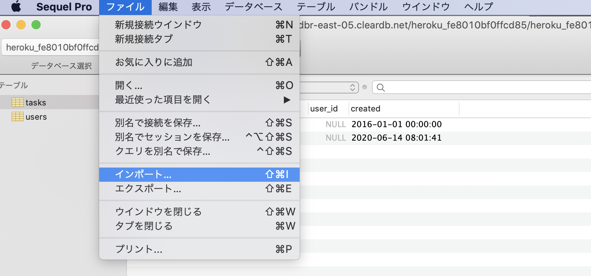

ローカル環境でつくったテーブルの設定(SQL文)記載のファイルを選択し、読み込みましょう
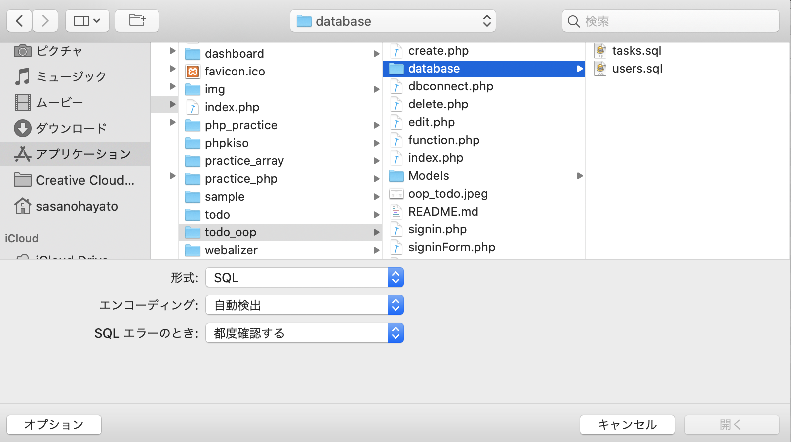

下記のようになれば成功です
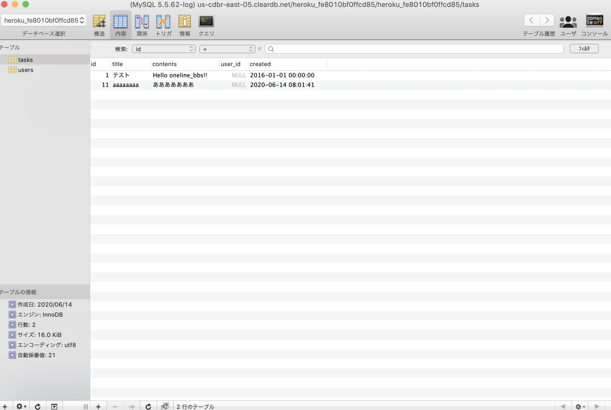

### 最後に
作成したアプリケーションと本番のDBを接続するために設定ファイルを本番ように編集しましょう

例) to_doアプリ dbconnect.php

編集しましょう
```
<?php

class DbManager
{
    public $dbh;

    public function connect()
    {
        DBに接続 local
        $host = "localhost";
        $dbname = "todo";
        $charset = "utf8mb4";
        $user = 'root';
        $password = '';
        
        $options = [
            PDO::ATTR_ERRMODE            => PDO::ERRMODE_EXCEPTION,
            PDO::ATTR_DEFAULT_FETCH_MODE => PDO::FETCH_ASSOC,
            PDO::ATTR_EMULATE_PREPARES   => false,
        ];

        $dsn = "mysql:host=$host;dbname=$dbname;charset=$charset";
        try {
            $this->dbh = new PDO($dsn, $user, $password, $options);
        } catch (\PDOException $e) {
            var_dump($e->getMessage());
            exit;
        }

    }
}

```

編集後

```
<?php

class DbManager
{
    public $dbh;

    public function connect()
    {
        // //DBに接続 local
        // $host = "localhost";
        // $dbname = "todo";
        // $charset = "utf8mb4";
        // $user = 'root';
        // $password = '';
        
        $host = getenv('host'); //MySQLがインストールされてるコンピュータ
        $dbname = getenv('dbname'); //使用するDB
        $charset = "utf8"; //文字コード
        $user = getenv('username'); //MySQLにログインするユーザー名
        $password = getenv('password'); //ユーザーのパスワード


        $options = [
            PDO::ATTR_ERRMODE            => PDO::ERRMODE_EXCEPTION,
            PDO::ATTR_DEFAULT_FETCH_MODE => PDO::FETCH_ASSOC,
            PDO::ATTR_EMULATE_PREPARES   => false,
        ];

        $dsn = "mysql:host=$host;dbname=$dbname;charset=$charset";
        try {
            $this->dbh = new PDO($dsn, $user, $password, $options);
        } catch (\PDOException $e) {
            var_dump($e->getMessage());
            exit;
        }

    }
}
```

下記編集しています
```
 // //DBに接続 local
        // $host = "localhost";
        // $dbname = "todo";
        // $charset = "utf8mb4";
        // $user = 'root';
        // $password = '';
        
        $host = getenv('host'); //MySQLがインストールされてるコンピュータ
        $dbname = getenv('dbname'); //使用するDB
        $charset = "utf8"; //文字コード
        $user = getenv('username'); //MySQLにログインするユーザー名
        $password = getenv('password'); //ユーザーのパスワード
```

ローカル環境下で接続していたDBの設定にコメントアウトを施し、
```
$host = getenv('host'); //MySQLがインストールされてるコンピュータ
$dbname = getenv('dbname'); //使用するDB
$charset = "utf8"; //文字コード
$user = getenv('username'); //MySQLにログインするユーザー名
$password = getenv('password'); //ユーザーのパスワード
```
こちらを追記しました

これが本番環境で接続するための設定です。

herokuの【Config Vars】を開きましょう。

下記の図のようにdbname,host,password,usernameと打ち込み、黒字で消されている箇所に、先程、Sequel proで入力したものと同じものを入力しましょう。
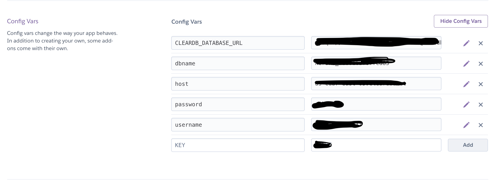


**なぜこんなことをするのか**
このあとGithubでさらに最新の状態にするためにpushをします.


```
$host = getenv('host');

```
$hostの後に、直接打ち込んでも構いません。
しかし、Gitで管理されているということを忘れてはなりません。
パスワードなど大事なものが誰からでも閲覧できてしまうのです。<br>

そのため下記の右辺のように変数を定義して、
実際の値はHerokuの【Config Vars】に入力し隠しておきます。
このような変数のことを**環境変数**といいます。
```
$host = getenv('host');

```
- KEY:環境変数
- VALUE:実際の値


すべて入力が終わればSourcetreeでpushし、最新の状態にしましょう。

終われば【Deploy】タブから手動デプロイし、【open app】からアプリケーションが表示できるか確認してみてください

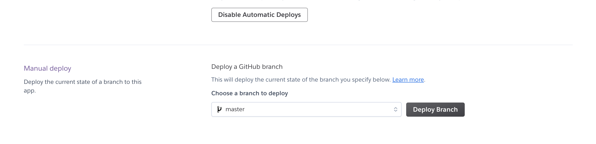
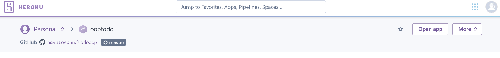

ローカルと本番環境差異がなく動作できていれば成功です。

## お疲れさまでした

これで自分の成果物が誰からでも閲覧できる状態を作りだせました。

自分のポートフォリオだと自信を持ちましょう。

またみなさんの大切な成果物です。

- なぜ作ったのか
- どういった機能があるのか
- 苦労した点
- 追加で実装したい機能

上記はまとめておきましょう。<br>
就職活動でよく聞かれます

