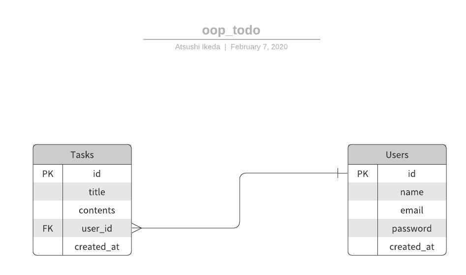

# PHP + MySQLを利用したTODOアプリの作成

## 実施する内容
- TODOアプリの作成(チーム開発)

## 要件
### 機能一覧
#### 必須
- タスクの作成ができる
  - 投稿した日を自動でDBに保存する
- タスクの一覧表示ができる
- タスクの編集ができる
- タスクの削除ができる

#### 任意
- 表示される順番を登録日が新しい順にする
- タスクの検索ができる
- 認証機能を実装する
  - サインアップ機能
  - サインイン機能
  - サインアウト機能

### ERD

### テーブル定義
### テーブル名: tasks
| 列名        | データ型    | NOT NULL | デフォルト | 備考                 |
| ----------- | ----------- | -------- | ---------- | -------------------- |
| id          | INT         | YES      |            | PK                   |
| title       | VARCHAR(30) | YES      |            | タスクの題名が入る   |
| contents    | VARCHAR(30) | NO       |            | タスクの詳細が入る   |
| user_id     | INT         | NO       |            | ユーザーのIDが入る   |
| created_at  | TIMESTAMP   | NO       |            | タスクの登録日       |

### テーブル名: users
| 列名        | データ型    | NOT NULL | デフォルト | 備考                 |
| ----------- | ----------- | -------- | ---------- | -------------------- |
| id          | INT         | YES      |            | PK                   |
| email       | VARCHAR(90) | NO       |            |                      |
| password    | TEXT        | NO       |            |                      |
| created_at  | TIMESTAMP   | NO       |            | アカウントの登録日   |

## その他
- エラー文は必ず読むようにしましょう。
- var_dumpを活用しましょう。
- すべてをまとめてやらずに1つ1つ順番に実施しましょう
- 1つ実装が終わったら必ず動作確認をしましょう。
