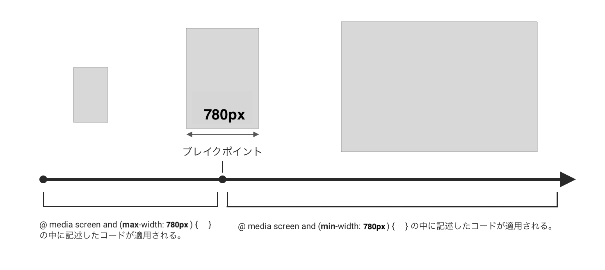

# レスポンシブ

1. 概要
2. メディアクエリの基本
3. モバイルファースト / デスクトップファースト
4. 実践

## 1. 概要

### レスポンシブとは

CSSのレスポンシブとは、パソコンやスマホ、タブレットなどの画面サイズの異なるデバイスでも、ユーザーが使いやすいように対応させることです。 


## 2. メディアクエリの基本
メディアクエリとは、指定した画面のサイズの時にのみ使われるCSSの要素などを決めるものです。
実際のコードを見てましょう。
```css
h1 {
 font-size: 30px;
}
@media screen and (min-width:780px) { 
    h1 { 
        font-size: 300px;
    }
}
```
`@media　screen and (min-width:480px) { }`は、画面の横幅（width）が480pxまでは、以下のCSSを適応するという意味です。よって上記のコードでは、「画面の横幅が480px以上の時はfont-sizeが300px、それ以外の場合は30pxということになります。
ちなみに`min`は`minimum`の略で最小値という意味です。
「以上・以下」や「最小値」など、混乱しそうになるので、下の図を参考に、頭の中を整理してみてください。




## 3. モバイルファースト / デスクトップファースト

上記の場合、デフォルトでは、フォントの大きさは30pxで、画面が480pxより大きい場合は300pxという条件を付けた書き方になっています。
これは、基本が小さい画面に合わせた書き方になっていると言えます。
このように、小さい画面を基本にした指定の仕方を**モバイルファースト**と言います。
逆に大きい画面を基本にした書き方は**デスクトップファースト**と言います。以下のように`min`ではなく、`max-wdith`と書いて指定します。

現在では、モバイルファーストで書くことが一般的になっています。スマートフォンの普及によって、モバイル端末からのアクセスが多くなったことが理由の一つです。

#### モバイルファーストの書き方
```css
h1 {
 font-size: 30px;
}
@media screen and (min-width:780px) { 
    h1 { 
        font-size: 300px;
    }
}
```
（画面が480pxより大きい時、300px）


#### デスクトップファーストの書き方
```css
h1 {
 font-size: 300px;
}
@media screen and (max-width:780px) { 
    h1 { 
        font-size: 30px;
    }
}
```
（画面が480pxより小さい時、30px）


## 4. 実践

htmlファイルに先ほどの説明で用いた、CSSのコード（モバイルファーストの方）を記述したファイルを紐付けて、ブラウザで開くと次のような画面になります。
画面の幅は変えると、文字が500pxから30pxに変わることが確認できます。


