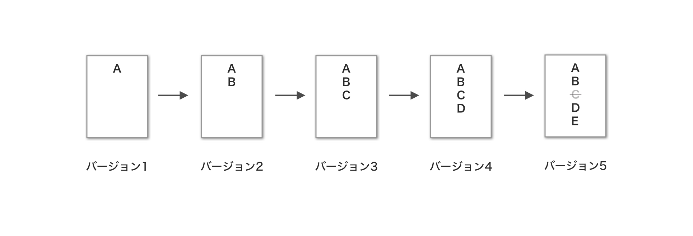

# GitとGitHub

## 1. Git

### Gitの基本概念
Gitは、プログラムのソースコードなどの変更履歴を記録・追跡するためのバージョン管理システムです。
<!-- （[Wikipedia](https://ja.wikipedia.org/wiki/Git）)） -->

この説明だけは理解しづらいと思うので、噛み砕いて説明します。

まず第一に、バージョン管理システムのバージョンとは何を差している言葉なのでしょうか？ 
バージョンとは、ファイルを変更して保存したそれぞれの地点のことです。

Gitとは簡潔にいうと、ファイルの変更点などを、保存しておき、変更前の状態に戻せることを可能にするシステムです。

 
 

### addとcommit

Gitのシステム上（Git Repository）に保存を行うことを`commit`（コミット）と言います。 
commitを行う前に、どのファイルをコミットするのか、指定するのが`add`（アド）です。

 
 

## 2. GitHubについて

GitHubは、ソフトウェア開発プロジェクトのためのソースコード管理サービスです。
コードをオンライン上にアップロードすることで、保存したり、他の人と共同で作業したりすることができます。

チームで開発する場合は、最初に誰か一人がリモートレポジトリを作成し、チームメンバーはそのファイルを自分のリモートレポジトリにコピー（クローン）を作成して、作業を行います。

そしてそれぞれのメンバーが変更を加えたものを再び、リモートレポジトリにプッシュし、それを合体させることをマージ（merge）と言います。

具体的な方法については、こちらで解説いたします。

ここでは、GitとGitHubに関する基本的な概念について解説しました。
最初はイメージが湧きにくいかと思いますが、使いながら徐々に慣れていきましょう。

お疲れ様でした！

- [CUIでGitHubにファイルをプッシュする手順](https://github.com/NexSeed00/STO/blob/master/PHP%E5%9F%BA%E7%A4%8E/Git/22-2_CUI%E3%81%A7%E3%83%95%E3%82%A1%E3%82%A4%E3%83%AB%E3%82%92push.md)

- [GUIでGitHubにファイルをプッシュする手順](https://github.com/NexSeed00/STO/blob/master/PHP%E5%9F%BA%E7%A4%8E/Git/22-1_Sourcetree%E6%93%8D%E4%BD%9C.md)
