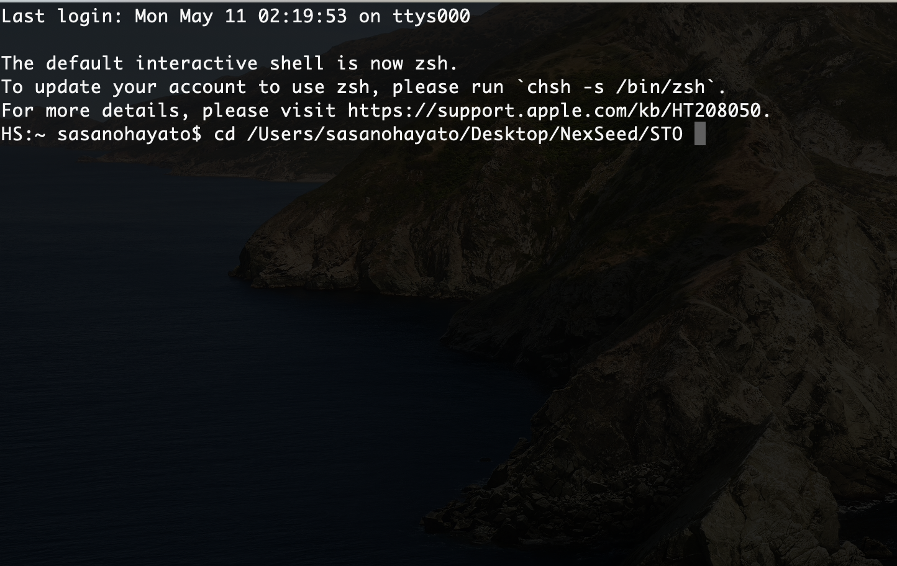

# GUIとCUI
ここではGUIとCUIの違いについて理解し、GUIとCUIツールの使い分けや他の人に簡単に説明できるようになりましょう。

## GUI
Graphical User Interfaceの略。普段使っているパソコンの操作。
 目で見てわかりやすい位置にボタンやフォルダがあり、操作もクリックやドラッグ等、比較的簡単で誰にでもできるインターフェイス（見た目）を提供している

## CUI
Charactical User Interfaceの略。文字だけでパソコンの中を操作する方法。GUIよりも前に生まれ、全てのパソコンはCUIで操作できる。「コマンド」と呼ばれる操作のための文字を知っている必要があり、見た目はただの文字のため、わかりづらい。

## GUIが生まれた歴史
マイクロソフトのWindowsが普及するまで世界のパソコンはほとんど専門的な知識のある技術者がCUIで操作していた。これを専門的な知識の無いユーザーも操作できるように考えだされたのがGUIであり、Windowsの普及によって爆発的にパソコンのユーザー数は増えていった背景がある。

## なぜSTOではCUI / GUIのどちらも勉強するのか

サーバーのOSにはほとんどGUIが搭載されていません。よってCUIでの操作を習得しないとサーバーの操作ができないです
サーバーはユーザーのリクエストに早くレスポンスを返すということが何よりも優先順位の高いタスクになります。GUIは便利ですが、わかりやすい画面を作り出すためにメモリを沢山消費してしまい、高速処理の邪魔をしてしまうためサーバーには不要のものとして認識されています。とは言え、GUIは初学者の方にとって非常に便利なツールです。CUIを使用しる際にはわかりにくいことでも可視化してくれることで、『いま自分が何を行っているのか』といったことを目でみて判断できます。また操作性にも優れ、実際の開発現場でも広く使用されているのも事実です。
STOではGUIとCUIの両方を学習し、使いこなせるようになることを目標に学習を進めていきます。

## 具体例
### CUI
ターミナル
 

 
### GUI
Sourcetree
 

 
MacはUNIX（LINUX）と同じコマンドが使える 
Mac OSはUNIXから派生したOSなのでCUIで同じコマンドが使えます。

## GUIとCUIを使いこなせるようになろう！
下記リンクからそれぞれGUIツール、CUIツールの使い方を学べます。
 ここで紹介するCUIはターミナル操作、いわゆる**コマンド操作**について学べます。
コマンド操作はUnix,Linuxについて学んだ後に取り組んでいきましょう。
 GUIツールはGitの操作を簡単に行える**Sourcetree**を紹介しています。GitやGithubについての講義を受けた後に取り組みましょう。簡単とは言っても学習はじめは操作することに慣れないと難しく感じるかもしれません。
 **繰り返し操作を行い習得していきましょう。** 
CUI: * [Sourcetree](https://github.com/NexSeed00/Git/blob/master/Sourecetree%E3%81%AE%E4%BD%BF%E3%81%84%E6%96%B9.md) 
 
GUI: * [Sourcetree](https://github.com/NexSeed00/HTML_CSS/blob/master/doc/02_css_basic.md) 
