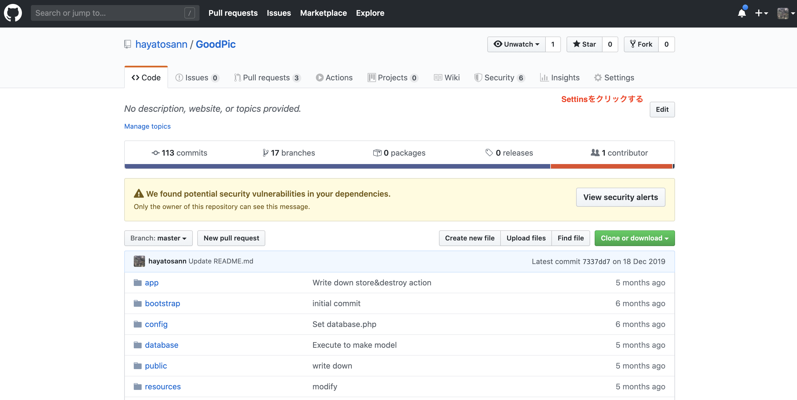
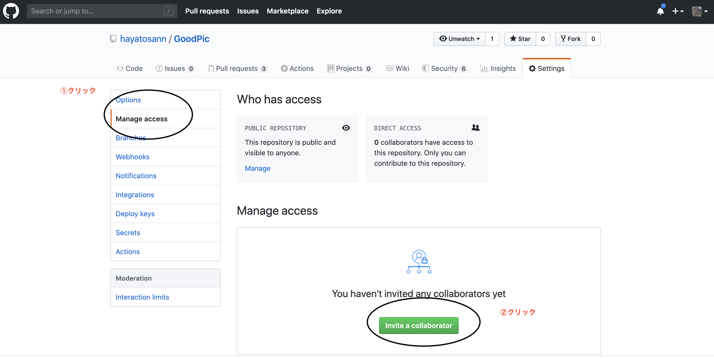

# コラボレータ登録

Githubのリポジトリを、複数人で共有するために行います。

## 登場人物
リーダー:Aさん
開発者:Bさん、Cさん

## 手順
### Aさん
#### step1
共同開発したリポジトリでSettingsをクリック

 

#### step2
図の通りに作業をすすめる

#### step3
共同開発を行いたい開発者のGithubのusernameかemailアドレスを入力

### Bさん,Cさん
送信されてきたemailから招待を許可する

