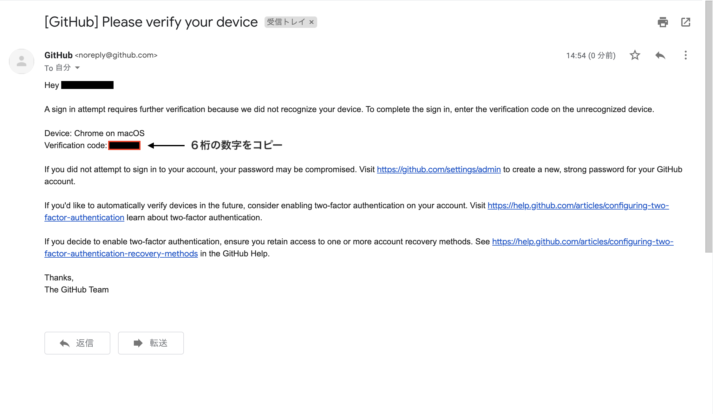
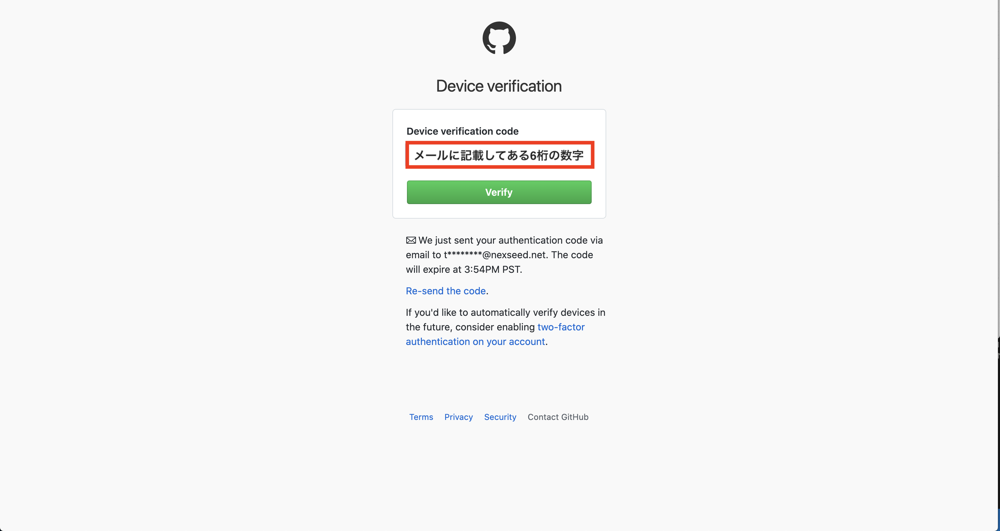
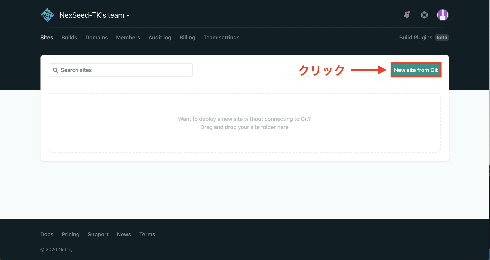
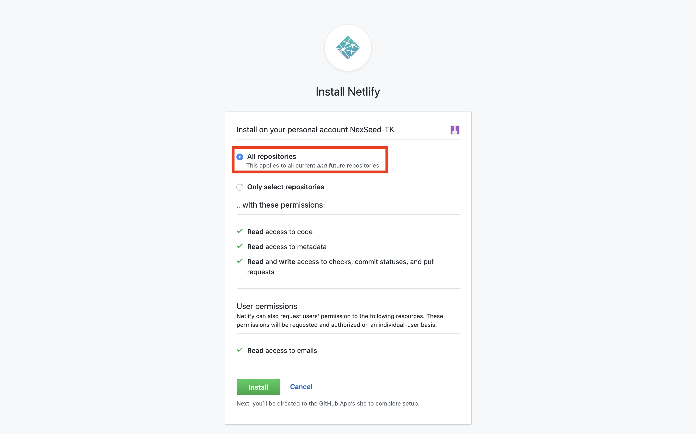
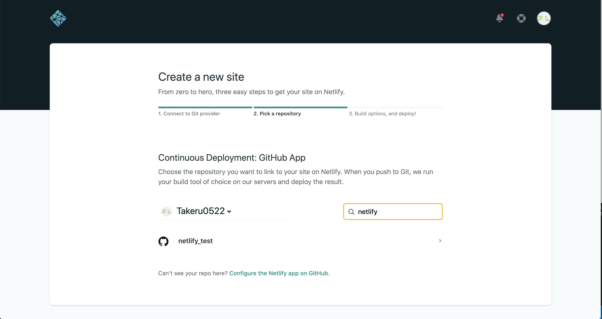
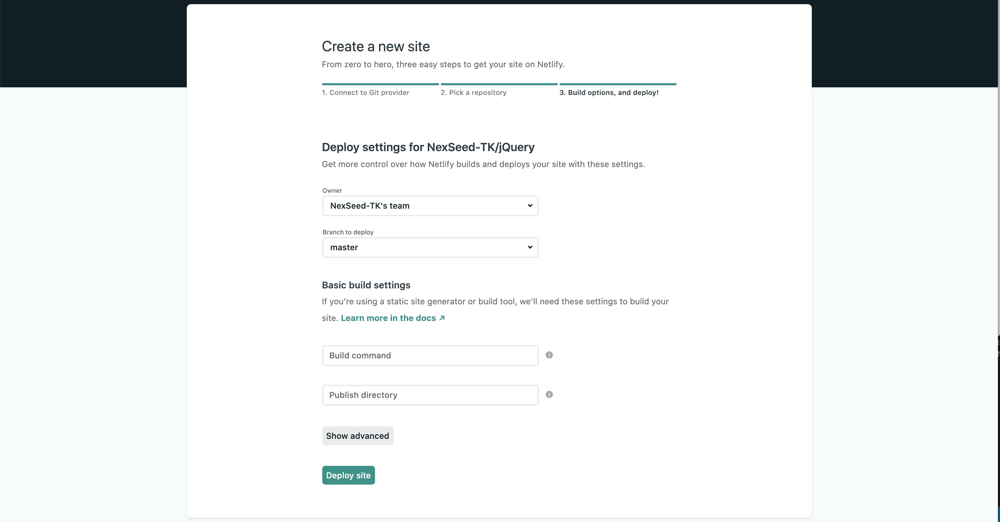
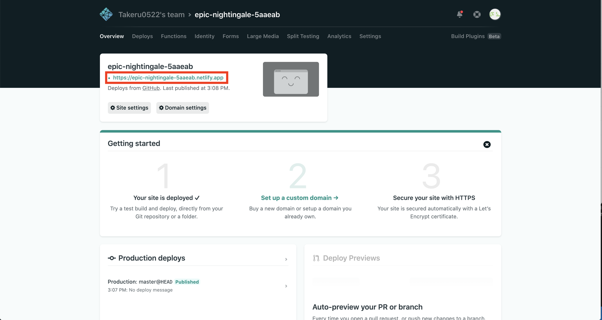

# Netlifyの使い方

Netlifyは、GitHubのレポジトリと連携して、アプリやウェブサイトをネット上で公開するサービスです。 
この解説はGitHubにレポジトリ作成までされている前提で進みます。 
まだできていない方は、以下のリンクからGit、GitHubの解説を先にお読みください。

* [GitとGitHubの概念](https://github.com/NexSeed00/git_basic)
* [GitHubにファイルをアップロードする手順](https://github.com/NexSeed00/github)

## 手順

1. Netlifyの登録
2. NetlifyとGitHubの連携
3. レポジトリの選択・公開

### 1. Netlifyの登録

以下のリンクからNetlifyに飛んでください。

https://www.netlify.com/

右上の「Sign up」をクリックします。

GitHubをクリックします。

GitHubのユーザーネームとパスワードを入力し、「Sign in」をクリックします。

GitHubのアカウントと紐づいているメールアドレス宛にメールが届きます。
６桁の数字をコピーしましょう。

コピーした数字を入力し、「Verify」をクリックします。

「Authorize Netlify」をクリックすると、Netlifyのユーザーページに入れます。

  

### 2. NetlifyとGitHubの連携

「New site from Git」をクリックします。

「GitHub」をクリック。

「Authorize Netlify by Netlify」をクリック

「All repositories」にチェックが入っていることを確認して、「Install」をクリックします。

これでNetlifyとGitHubの連携ができました。

  

### 3. レポジトリの選択・公開

GitHubにあるレポジトリの一覧が表示されています。

表示されていない場合は、検索をかけましょう。

公開したいレポジトリをクリックすると以下の画面になります。 
ここの設定はいじらなくて大丈夫です。 
１番下の「Deploy site」をクリックします。

ユーザーページに自動的に戻ります。
デプロイが完了すると赤い枠の箇所にリンクが表示されます。

リンクをクリックして、ウェブサイトを確認しましょう。

  

説明は以上です。 
お疲れ様でした！
