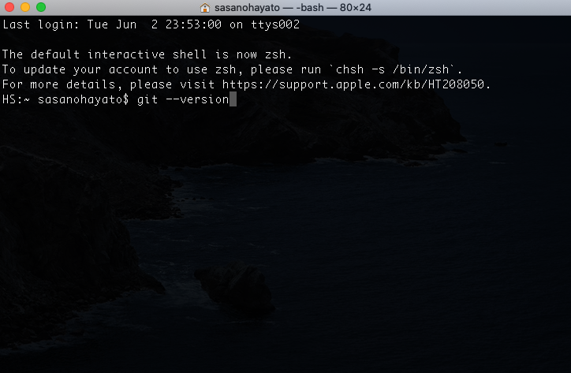

# Gitインストール方法

## Mac編

### step1 ターミナルを開く

スポットライト検索にて【ターミナル】と検索しましょう


コマンドキー(⌘)とスペースバーを同時に押すと、以下のようなSpotlightというウインドウが開きます。


下記のような画像となっていれば成功です。



### step2 Gitインストール

```
$ git --version
```
上記コマンドをターミナルに打ち込みEnterを押しましょう


ターミナルで下記のように表示されれば成功です。

```
git version x.xx.x
```

もし、Gitのバージョン番号ではなく、以下のようなウィンドウが表示された方は、コマンドライン・デベロッパーツールをインストールしましょう。


次に、使用許諾契約が表示されると思いますので、内容に問題がなければ「同意する」をクリックしてください。
ここまで完了するとダウンロードとインストールが実行されます。
インストールが完了すると、Gitを使えるようになります！

ターミナルで再度、下記を入力しましょう

```
$ git --version
```

下記のように表示ができれば成功です。
```
git version x.xx.x
```

**これでもうまく行かない場合、まずは下記の操作を行ってください**

https://git-scm.com/downloads

上記へアクセスし、DownloadsにあるMac OS Xのgitをダウンロードするためクリックします。


インストーラのダウンロードが完了したら実行しましょう。

インストールまで完了すると、gitコマンドが使えるようになっています。

ターミナルで再度、下記を入力しましょう

```
$ git --version
```

下記のように表示ができれば成功です。
```
git version x.xx.x
```

**それでもうまく行かない場合のみ下記の操作を行ってください**

## homebrewを使用してGitをインストールする

### step1 homebrewのインストール

下記コマンドをターミナル上で実行しましょう

```
$ ruby -e "$(curl -fsSL https://raw.githubusercontent.com/Homebrew/install/master/install)"

```

下記の図のようにしてください


処理が終われば成功です。

※実行すると下記の図が表示されることがあります。


その場合、インストールを選択し、進んでいきましょう。処理が終われば成功です。

### step2 Gitをhomebrewからインストールする

```
brew install git
```

上記コマンドをターミナルで入力してください。

処理が終われば、インストール完了です.

ターミナルで、下記を入力しましょう

```
$ git --version
```

下記のように表示ができれば成功です。
```
git version x.xx.x
```

## 最後に
わからないことがあれば、slackやバーチャルスタディルームを活用し、お気軽に講師に質問してください。<br>

