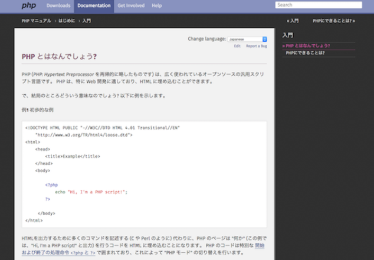

# PHPとは
PHP（PHP: Hypertext Preprocessor）は、動的なWebサイトの作成を目的とした、サーバーサイドで動作するプログラミング言語です。
クライアントからサーバへリクエストが送られた際、サーバがHTML内に記述されているPHPのプログラムの処理を実行し、処理結果をHTMLページにしてクライアントへ返します。 そのため、クライアント側ではPHPのプログラムを見ることはなく、処理結果だけ見ることができます。
シンプルな文法に加え多くの便利な機能を持ち、簡単なWebサイトから大規模なWebサイトまで幅広く利用されています。

PHPの大きな特徴として、 **HTMLに埋め込んで記述可能** な点が挙げられます。
PHPでは<?phpと?>で囲まれた部分を、PHPのプログラムコードとして解釈します。`<?php`と`?>`は、それぞれPHPの開始タグ／終了タグと呼ばれ、これらのタグで囲まれていない部分はそのまま出力されます。

# PHPの歴史
1995年6月、Rasmus Lerdorf（ラスマス・ラードフ）氏によって作成されたPHP1.0が公開されました。 当初PHPは現在のPHP: Hypertext Preprocessorの略ではなく、Personal Home Page Tools（PHP Tools）という名前でした。
1998年6月にPHP3.0が公開され、その時点ですでに多くのPHP利用者がおり、3.0の公開にあたって現在のPHP: Hypertext Preprocessorに改名されました。

2016年8月現在、PHPの最新バージョンは7.0になりますが、皆さんがXAMPPで使用するPHPのバージョンは5.6系かと思います。

PHPは公式マニュアルがバージョンごとに充実しており、今後プログラミングを学習していく際のリファレンスとして頻繁に使用することになるので、ブックマークしておきましょう。

公式マニュアル:https://www.php.net/manual/ja/index.php

