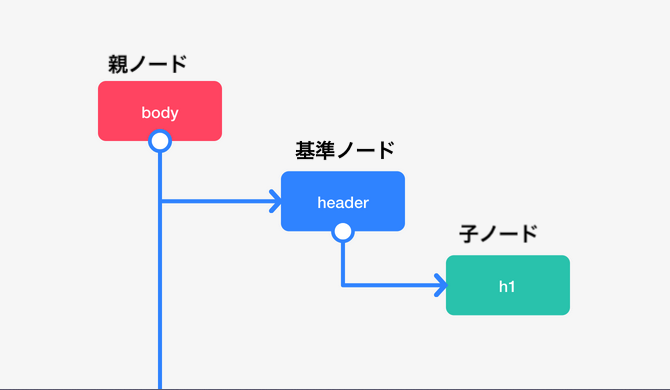

# DOMとは

## 学ぶこと
ここでは**DOM**について
簡単に解説します。

## ゴール
- DOMについて簡単に説明できる

## 概要
DOMとは「Document Object Model」の略です。
Document Object Model (DOM) は HTML や XML 文書のためのプログラミングインターフェイスです。
「プログラミングインターフェイス」とは、機能や規則の集合体と言う意味になります。
つまり、DOMとは「HTML や XML 文書を操作するための、たくさんの機能や規則。」です。
更に一言で表すと、*JavaScriptからHTMLを操作するための仕組み*と言えるでしょう。

## DOMの定義と役割
### DOMの定義
- Core DOM：すべてのドキュメントタイプの基本となるモデル
- XML DOM：XMLドキュメントの基本となるモデル
- HTML DOM：HTMLドキュメントの基本となるモデル
皆さんにとって馴染みがあるHTMLについてのDOMの定義をみてみましょう。
### HTML DOMの役割
- HTML要素をオブジェクトとして表現する
- 全てのHTML要素のプロパティ
- 全てのHTML要素にアクセスしうるためのメソッド
- 全てのHTML要素のためのイベント
つまりこれらの役割を一言で簡単に表すと、『DOMによりHTML要素を取得したり、変更したり、挿入したり、削除したりできる』と表現できます。
DOMによって、**JavaScriptというプログラミング言語、jQueryを使用し、
WEBページの文書構造であるHTMLやスタイリングCSS、コンテンツの内容を操作することができるのです。**

## DOMの特徴
- HTMLをツリー構造（階層構造）として表現。
- 要素をノードと表現。
- Webページとプログラミング言語（JavaScript）をつなぐ。

## DOMツリーとは

 
WEBページが読み込まれた時に、ブラウザ（Chrome,Safari,Firefoxなど）は、
その読み込まれたページのDOMを形成します。その階層構造のことをDOMツリーと呼びます。

## ノードとは

 
ノードとは各要素(HTMLではエレメントやタグという)自体のことを表します。
特定のノードを基準としたときに、その上にあるノードを「親:parent」ノードと表現し、その下にあるノードを「子:childまたはchildren」ノードと表現する。
また同一階層にあるノードのことを「兄弟姉妹:siblings」ノードと表現する。
例えば「そのタグの子ノード全体を取得して、その親ノードから削除する」のような使い方をします。

## まとめ
**DOMとは,JavaScriptからHTMLを操作するための仕組みのこと**
 
**DOM操作により、HTML要素（ノード）を取得、変更、挿入、削除ができる。**
 
文章を読んでいてもイメージが湧きにくいと思います。
実際に練習問題を通してDOMを操作してみましょう。

## 参考
[DOM.pdf](https://github.com/NexSeed00/document/files/4663465/DOM.pdf)

