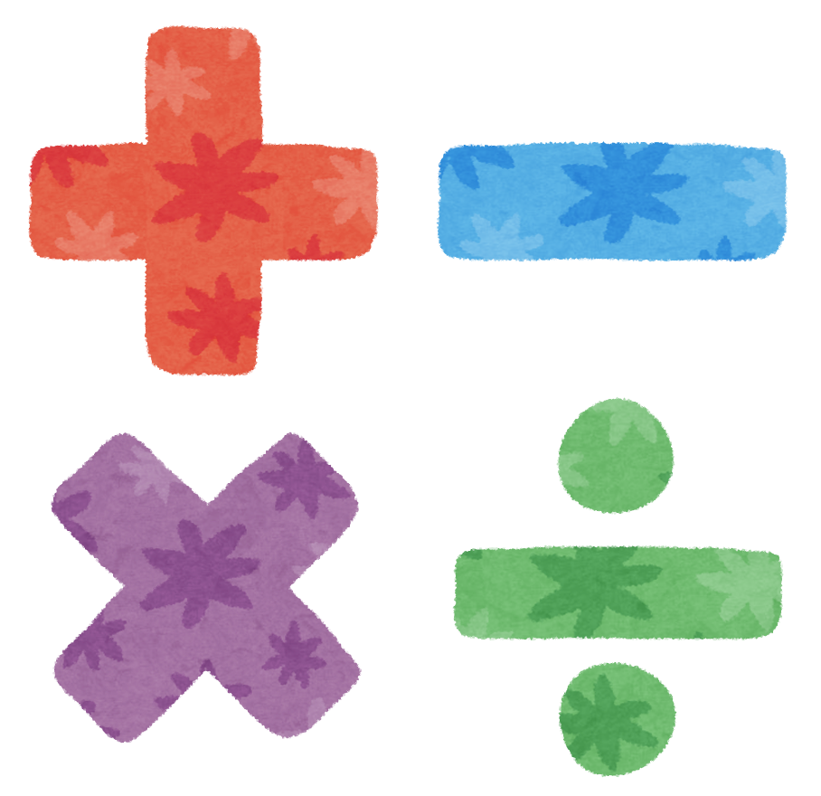

# 四則演算


## このカリキュラムの目標
1. プログラムを使って様々な計算ができるようになる

## 導入
JavaScriptには、数値に対して計算を行う演算子が用意されています。 

### 算術演算子とは
算術演算子とは、プログラムにおいて、**足し算**、**引き算**、**掛け算**、**割り算**等を行うために使う演算子のことです。  
数学の ＋ － × ÷ と同じものだと考えてください。

算術演算子の種類

|演算子|概要|例|
|---|---|---|
|+|足し算|x + y|
|-|	引き算|x - y|
|*|	掛け算|x * y|
|/|	割り算|x / y|
|%|	剰余算|x % y|

### 計算してみよう
1. 1 + 1を計算して、出力しましょう。

	```
	console.log(1 + 1);
	
	```
2. 5 - 1を計算して、出力しましょう。

	```
	console.log(5 - 1);
	
	```
	
3. 2 × 8を計算して、出力しましょう。

	```
	console.log(2 * 8);
	
	```
	
4. 6 ÷ 2を計算して、出力しましょう。

	```
	console.log(6 / 2);
	
	```

5. 5 ÷ 2を計算して、余りを出力しましょう。

	```
	console.log(5 % 2);
	
	```
	
### 練習問題
以下の変数を作成してくだい。

|変数名|値|
|---|---|
|a|5|
|b|	12|
|c|	13|
|d|	20|

```
var a = 5
var b = 12
var c = 13
var d = 20
```

1. 変数aと変数bと変数cを足した結果を出力してください。

	<details><summary>回答例</summary><div>

	```
	console.log(a + b + c);
	```
	
	</div></details>
	
2. 変数aと変数bを足した結果と変数cを掛けた結果を出力してください。

	<details><summary>回答例</summary><div>

	```
	console.log((a + b) * c);
	```
	
	</div></details>
	
3. 変数dから変数aを引いた結果を出力してください。

	<details><summary>回答例</summary><div>

	```
	console.log(d - a);
	```
	
	</div></details>
	
4. 変数bと変数cを掛けた結果を出力してください。

	<details><summary>回答例</summary><div>

	```
	console.log(b * c);
	```
	
	</div></details>
	
5. 変数dを変数aで割った結果を出力してください。

	<details><summary>回答例</summary><div>

	```
	console.log(d / a);
	```
	
6. 変数dを変数cで割った余りを出力してください。

	<details><summary>回答例</summary><div>

	```
	console.log(d % c);
	```
	
	</div></details>